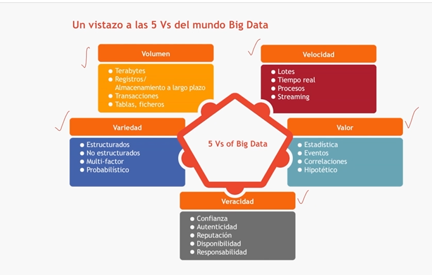

# Computación de Sistemas Distribuidos

Profesor: Alfonso Antolínez García

# Contenido del Curso 

- [Unidad 0. Objetivos del curso](https://github.com/cestebann/Master-Big-Data-Universidad-Europea/blob/master/Computaci%C3%B3n%20en%20sistemas%20distribuidos.md#unidad-0-objetivos-del-curso)
    - [Competencias específicas](https://github.com/cestebann/Master-Big-Data-Universidad-Europea/blob/master/Computaci%C3%B3n%20en%20sistemas%20distribuidos.md#unidad-0-objetivos-del-curso)
    - [Resultados del aprendizaje](https://github.com/cestebann/Master-Big-Data-Universidad-Europea/blob/master/Computaci%C3%B3n%20en%20sistemas%20distribuidos.md#resultados-de-aprendizaje)
- [Unidad 1. Sistemas altamente distribuidos](https://github.com/cestebann/Master-Big-Data-Universidad-Europea/blob/master/Computaci%C3%B3n%20en%20sistemas%20distribuidos.md#1-sistemas-altamente-distribuidos)
    - [Los sistemas distribuidos en el mundo Big Data](https://github.com/cestebann/Master-Big-Data-Universidad-Europea/blob/master/Computaci%C3%B3n%20en%20sistemas%20distribuidos.md#los-sistemas-distribuidos-en-el-mundo-del-big-data)
    - [Introducción a los sistemas distribuidos](https://github.com/cestebann/Master-Big-Data-Universidad-Europea/blob/master/Computaci%C3%B3n%20en%20sistemas%20distribuidos.md#introducci%C3%B3n-a-los-sistemas-distribuidos)
    - [Paradigma de programación paralela](https://github.com/cestebann/Master-Big-Data-Universidad-Europea/blob/master/Computaci%C3%B3n%20en%20sistemas%20distribuidos.md#paradigma-de-programaci%C3%B3n-paralela)
    - [Tolerancia a fallos en sistemas distribuidos](https://github.com/cestebann/Master-Big-Data-Universidad-Europea/blob/master/Computaci%C3%B3n%20en%20sistemas%20distribuidos.md#tolerancia-a-fallos-en-sistemas-distribuidos)
- [Unidad 2. Sistemas cloud y virtualización de servicios](https://github.com/cestebann/Master-Big-Data-Universidad-Europea/blob/master/Computaci%C3%B3n%20en%20sistemas%20distribuidos.md#2-sistemas-cloud-y-virtualizaci%C3%B3n-de-servicios)
    - [Computación y almacenamiento en la nube](https://github.com/cestebann/Master-Big-Data-Universidad-Europea/blob/master/Computaci%C3%B3n%20en%20sistemas%20distribuidos.md#computaci%C3%B3n-y-almacenamiento-en-la-nube)
    - [Consolidación de servicios](https://github.com/cestebann/Master-Big-Data-Universidad-Europea/blob/master/Computaci%C3%B3n%20en%20sistemas%20distribuidos.md#consolidaci%C3%B3n-de-servicios)
    - Amazon AWS
    - Google Web Services
- [Unidad 3. Hadoop como sistema de cómputo en plataformas Big Data](https://github.com/cestebann/Master-Big-Data-Universidad-Europea/blob/master/Computaci%C3%B3n%20en%20sistemas%20distribuidos.md#3-hadoop-como-sistema-de-c%C3%B3mputo-en-sistemas-distribuidos)
    - [Apache Hadoop](https://github.com/cestebann/Master-Big-Data-Universidad-Europea/blob/master/Computaci%C3%B3n%20en%20sistemas%20distribuidos.md#apache-hadoop)
    - [Hadoop Distributed File System](https://github.com/cestebann/Master-Big-Data-Universidad-Europea/blob/master/Computaci%C3%B3n%20en%20sistemas%20distribuidos.md#introducci%C3%B3n-a-hadoop-distributed-file-system-hdfs)
    - [Arquitectura de cómputo de Hadoop](https://github.com/cestebann/Master-Big-Data-Universidad-Europea/blob/master/Computaci%C3%B3n%20en%20sistemas%20distribuidos.md#arquitectura-de-c%C3%B3mputo-de-hadoop)
    - Ejecución de aplicaciones en Apache Hadoop.
- <s> Unidad 4. Programación en Scala </s>
    - <s>Introducción al lenguaje Scala</s>
    -<s> Estructuras de control y definición de funciones</s>
    - <s>Listas y contenedores</s>
    - <s>Programación funcional</s>
- Unidad 5. Computación distribuida con Apache Spark
    - Introducción a Apache Spark
    - Programación de aplicaciones con Apache Spark
    - Acceso a fuentes de datos con Apache Spark
    - Gestión de trabajos Spark con Apache YARN
- Unidad 6. Apache Spark avanzado
    - Spark Streaming
    - Ingestión de datos de Twitter mediante Apache Streaming
    - Aprendizaje automático con Mllib
    - Despliegue de aplicaciones con Maven y SBT

# Unidad 0. Objetivos del curso

## Competencias específicas:
- Aplicar las bases teórico-prácticas necesarias sobre Tecnologías de la Información y Comunicaciones de interés para el desarrollo e implantación de servicios de análisis y extracción de modelos a partir de los datos en infraestructuras de altas prestaciones.
- Diseñar, implantar, y administrar redes e infraestructuras físicas para el tratamiento de grandes volúmenes de datos distribuidos.
- Diseñar y ejecutar un proceso completo de descubrimiento de conocimiento, incluyendo las fases de almacenamiento, procesamiento y visualización de los datos.
- Aplicar las bases técnicas del funcionamiento de plataformas cloud computing y virtualizadas.

## Resultados de aprendizaje:
- Aplicar las bases técnicas y funcionales de sistemas distribuidos de altas prestaciones.
- Desarrollar algoritmos y usar de tecnologías para el acceso a bases de datos de nueva generación.
- Planificar e integrar bases de datos de nueva generación en sistemas distribuidos.

# 1. Sistemas altamente distribuidos

## Los sistemas distribuidos en el mundo del Big Data

El modelo de programación en Big Data consiste en: 

1. La recolección de una gran cantidad de información a través distintos medios. 
2. Aplicar el conocimiento necesario para transformar y analizar dicha información. El analista de datos es clave porque une conocimiento + datos. 
3. Todo este proceso debe resultar en valor

La aproximación basada en Big Data abordará la simplificación de la programación, de tal forma, que no tengamos que preocuparnos por el despliegue de nuestros algoritmos distribuidos, inicialmente con un despliegue y configuración complejo.



La siguiente figura muestra un flujo de trabajo típico de las aplicaciones Big Data


A la hora de programar aplicaciones basadas en Big Data, tendremos que afrontar dos grandes retos: el rendimiento y la complejidad.

Por un lado, deberemos ser capaces de desarrollar soluciones que escalen con el tamaño del volumen de datos a procesar. El rendimiento lo conseguiremos a través de sistemas distribuidos y con la participación de múltiples computadoras.

Conocer la ubicación de los datos será fundamental. Usar este nuevo modelo implicará que tendremos que llevar el cómputo a los datos y no al contrario, como se ha venido haciendo hasta ahora.

## Introducción a los sistemas distribuidos

A día de hoy, los sistemas distribuidos son una parte fundamental de cualquier infraestructura computacional. Desde teléfonos inteligentes a los grandes sistemas de cómputo, los sistemas deben estar interconectados para llevar a cabo acciones complejas.

En este tema se abordarán **cuáles son los factores necesarios para el diseño de un sistema altamente conectado y eficiente.** Todos los sistemas existentes de procesamiento masivo de datos están basados en sistemas distribuidos, desde Apache Hadoop a Apache Spark. Por lo tanto, conocer el funcionamiento de los sistemas distribuidos es un factor clave para entender el movimiento de datos y la computación masivamente distribuida.

### Inicio de los sistemas distribuidos 

La era de la informática moderna comenzó a partir de 1945. Hasta 1985, las computadoras eran grandes y caras, además por falta de conectarlas entre sí, actuaban de manera independiente. Sin embargo, dos factores tecnológicos cambiaron esta situación: 

- **Microprocesadores.** Con las CPUs multinúcleo, nos enfrentamos al reto de desarrollar programas para explotar el paralelismo. 
- **Redes informáticas de alta velocidad.** 
    - LAN (Local Area Networks). Permiten que varios dispositivos en una casa, una oficina o un edificio estén conectados. 
    - WAN (Wide Area Networks). Cientos de millones dispositivos conectados globalmente a velocidades del orden de cientos de millones bps. 
    - MPLS. Lo instala la compañía telefónica, instala un gran ancho de banda, que luego fragmenta en tuberías virtualizadas para venderlo a clientes individuales. Como consecuencia, es muy fácil crear recursos o desensamblar la red.  

Paralelamente a estos factores, se ha ido desarrollando la **miniaturización** de los sistemas informáticos, siendo el resultado más deslumbrante el *smartphone*. 

Como consecuencia, no sólo es fácil sino también factible construir un sistema distribuido, que consiste en una red de computadoras dispersas geográficamente. El tamaño puede ser de un puñado a millones de nodos y la red de interconexión puede ser cableada, inalámbrica o un híbrido. 

#### ¿Qué es un sistema MainFrame? 


Los clústeres de servidores se han convertido en el reemplazo de los mainframes en muchas grandes empresas, como Amazon y Google.

#### ¿Qué son las redes de datos de alta velocidad? 

Las redes de datos permiten conectar usuarios y “maquinas” a recursos que están alojados fuera de su entorno de trabajo. 

#### ¿Qué protocolos de conexión física conoces?

- IDE
- USB
- SATA
- eSATA
- PCI Express 1.0, 2.0 

#### ¿Principales diferencias entre redes de datos y conexiones físicas? 

- distancia a la que operan.
- Protocolos de comunicación que utilizan. 

#### ¿Qué topologías de datos conoces? 

- Local area networks (LAN)
- Metropolitan area networks (MAN)
- Wide area networks (WAN)

### Protocolos de Red

#### ¿Qué son los protocolos de red y cuántos conoces? 

Son estándares formales compuestos por reglas, metodología y configuracionesque definen la comunicación entre dos o más dispositivos a través de una red.
Para poder enviar y recibir información, los dispositivos a la red deben seguir estos protocolos.

- **Network Time Protocol (NTP):** es un protocolo que sincroniza los relojes de los sistemas informáticos a través de las redes de datos. NTP permite que los dispositivos conectados a la red sincronicen su configuración horaria con el servidor NTP.
- **Domain Name System (DNS, Sistema de Nombres de Dominio)**: DNS traduce los nombres de dominio a direcciones IP. Resuelve un localizador uniforme de recursos o una dirección de sitio web en la dirección IP del sitio. 

#### ¿Qué es un protocolo de enrutamiento?

- **Routing Information Protocol (RIP)** es un protocolo de enrutamiento dinámico que utiliza el conteo de saltos como métrica de enrutamiento para encontrar la mejor ruta entre la red de origen y la de destino. Tiene un valor AD (Administrative Distance) de 120 y funciona en la capa de red del modelo OSI.
- **AD (Administrative Distance)**, es un valor que representa la confiabilidad de un protocolo de enrutamiento específico. Cada protocolo de enrutamiento tiene su propia AD. Si un enrutador aprende una ruta de destino de dos o más protocolos de enrutamiento, selecciona la ruta del protocolo que tiene la distancia administrativa más pequeña.
-**Dynamic Host Control Protocol (DHCP)** utiliza un servidor para asignar una dirección IP e información de configuración a los dispositivos de red. Como resultado, el dispositivo obtiene una hoja de permiso del servidor DHCP para usar la red. 

#### ¿Qué son los Protocolos TCP y/o Modelos de Operación?

Los sistemas distribuidos y Cloud existen porque se han dado las condiciones. Entre ellas están los protocolos de red. 

Es importante porque seguramente si trabajamos con una app Cloud como AWS, a la hora de hacer un despliegue en una infraestructura, con toda seguridad vamos a tener que instalar una VPC y subredes; segmentar una subred para poder tener direcciones de red suficientes; saber abrir puertos. 

TCP/IP define como se ha de transmitir la información entre el emisor y el receptor.


### ¿Cómo definirías el Concepto de Sistema Distribuido?

> “A collection of independent computers that appear to the users of the system as a single computer.” - Tanenbaum 

> “A system in which hardware or software components located at networked computers communicate and coordinate their actions only by message passing.” - Coulouris

Los sistemas distribuidos están commpuestos por los siguientes elementos: 
- **Programa**: Conjunto de instrucciones
- **Proceso**: Secuencia de ejecución.
- **Datos**: Información ejecutada por el programa. 
-**Componente**:Elemento HW o SW que soporta la ejecución sistema.
-**Red de computadoras**: Un conjunto de computadores conectados por una red de interconexión.
-**Protocolo**: Un conjunto de reglas e instrucciones que gobiernan la comunicación en un sistema distribuido, es decir, el intercambio de mensajes.
-**Middleware**: Software que soporta la ejecución de aplicaciones distribuidas.
 
#### ¿Ventajas?
- Compartir recursos (HW, SW, datos).
- Ofrecer una buena relación coste-rendimiento: 
    - Paralelismo: este modelo utiliza el "paralelismo“ en los procesos, en el que todas las computadoras del clúster gestionan simultáneamente un subconjunto de las tareas generales.
    - Commodity Hardware.
- Escalabilidad: aumentar la capacidad de crecimiento. 
- Proporcionar tolerancia a fallos. 
    - El sistema aplica la redundancia: Varias computadoras pueden brindar los mismos servicios, y además los datos (ficheros, carpetas, objetos) pueden estar replicados en distintos servidores para su lectura/escritura. 
- Aumentar disponibilidad. 
- En sistemas de gran escala, los sistemas distribuidos son una aproximación excelente para la distribución de la carga de trabajo y el aumento de la concurrencia con la que podemos ser capaces de ofrecer servicios a múltiples a usuarios de forma simultánea.
- Agnósticos al proveedor de software/hardware y a protocolos. 

#### ¿Desventajas?
- Complejidad. Son difíciles de implementar. mantener y solucionar. No solo se limita al hardware, sino también al software. Varios sistemas trabajando al mismo tiempo (leyendo y escribiendo) pueden provocar fallos en el sistema e inconsistencias en los datos. 
- Coste de entrada inicial alto 
- Cuellos de botella en transferencia de red. Cuando los datos se distribuyen entre varios nodos, es necesario moverlos.
- Fallos debido a errores humanos. Con múltiples componentes el factor de error aumenta. 

### Sistemas distribuidos vs. Computación Paralela

#### ¿Cuáles son las diferencias entre un sistema distribuido y una computación paralela? 

En una topología de procesamiento en paralelo: 
- La carga de trabajo se distribuye en varios procesadores en una o más computadoras, denominadas nodos de cómputo. 
- Los entornos de procesamiento en paralelo se clasifican como: 
    - Sistemas de multiprocesamiento simétrico (symmetric multiprocessing, SMP).  Uno o más procesadores que comparten componentes de hardware. 
    - Procesamiento paralelo masivo (massively parallel processing, MPP). Es una arquitectura donde hay muchas computadoras alojadas físicamente en un mismo chasis. Son las famosas supercomputadoras. 

#### ¿Qué es un Sistemas de multiprocesamiento simétrico (SMP)?

En un paradigma varios procesadores comparten los recursos hardware. Ej: Varios procesadores comparten la misma memoria y espacio en disco, y usan un solo sistema operativo. 

#### ¿Qué es un Procesamiento paralelo masivo (MPP)?

Un sistema MPP, está físicamente disperso. 
- El rendimiento mejora al no compartir recursos físicos. 
- El sistema escala agregando commputadoras, disco y memoria. 
- Un sistema de archivos se comparte por medio de red. 
- Los archivos de programa se pueden compartir en el sistema en lugar de copiarse en cada disco individual .

La computación paralela se enfoca en la realización de tareas computacionales individuales de manera más rápida mediante la división de la tarea en múltiples subprocesos que se ejecutan simultáneamente en múltiples dispositivos de procesamiento. Por otro lado, los sistemas distribuidos se enfocan en la coordinación de múltiples dispositivos de procesamiento para realizar tareas de manera distribuida, donde cada dispositivo procesa una parte diferente de la tarea.

### ¿Qué es un middleware?

**Middleware:** Un middleware es un capa que facilita la conexión de aplicaciones que no fueron diseñadas para conectarse entre sí, brindando una funcionalidad mayor que operando independientemente. Es capaz de asegurar que múltiples procesos ocurriendo sobre un mismo recurso no corrompe los datos. 

> El middleware actúa como un puente entre tecnologías, herramientas y bases de datos diversas para que pueda integrarlas sin dificultad en un único sistema. - AWS 

Los sistemas distribuidos se encargan para tener una capa separada de software para facilitar el uso de aplicaciones compartidas


Las funciones de un middleware son: 
- Permitir que los componentes, procesos o aplicaciones intercambien información. 
- Ocultar el carácter "distribuido" de los nodos y la heterogeneidad de los componentes. 
- Ofrecer interfaces de alto nivel de estándar y uniformes para el desarollo de apps. 
- Ofrecer servicios comunes para facilitar la comunicación entre aplicaciones. 

#### ¿Qué Tipos de middleware conoces?

- Servidores de aplicación web o middleware de dispositivos móviles.
- *Integración basada en la nube como servicio* (Integration Platform as a Service, IPaaS) es una solución basada en la nube que simplifica la integración en entornos locales (on-premises ) y en la nube. Es una solución de autoservicio
- bus de servicio empresarial (Enterpise Service Bus, EBS)
- *Message brokers.* traducen mensajes entre diferentes protocolos de mensajería, permitiendo que los servicios interdependientes "hablen" entre sí directamente, incluso estando escritos en diferentes lenguaje y/o implementados en diferentes plataformas.


### Diseño de sistemas distribuidos

Para construir un sistema distribuido exitoso, es necesario cumplir los siguientes criterios: 

1. Un sistema distribuido debe hacer que los recursos sean fácilmente **accesibles**.
2. El sistema distribuido en **red** debe ser imperceptible para el usuario final, este debe pensar que esta tratando con una única computadora.
3. Debe estar **abierto**.
4. Debe ser **escalable**.

Aspectos a tener en cuenta los aspectos de diseño: 
- Heterogeneidad: Contemplar diferentes HW, SW, lenguajes de programación, velocidad, etc.
- Extensibilidad: Abierto a nuevos estándares, aplicaciones, tecnologías.
- Escalabilidad: Es escalable si su capacidad de procesamiento puede crecer al añadir más usuarios, aumenta el rendimiento al aumentar el número de nodos, el tiempo de respuesta no aumenta y la fiabilidad no se degrada.
- Seguridad: Confidencialidad, integridad, autenticación.
- Tolerancia a fallos y disponiblidad: Al estar compuesto por varios elementos, naturalmente es más propenso a errores por su gran tamaño. Un sistema es tolerante a fallos si el sistema cumple sus especificaciones a pesar de la presencia de fallos. Por lo tanto, se debe asegurar **disponibilidad**, es decir, que los recursos son accesibles a pesar de que se presenten fallos, y que la consistencia de los recursos se asegurare a pesar de los fallos (atomicidad).
- Control de concurrencia: Coordinar las acciones que ocurren al mismo tiempo en diferentes sistemas. 

Existen diferentes técnicas para el aumento de escalabilidad en los sistemas, como son: 
- Replicación de datos: múltiples copias del mismo dato. 
- Replicación de procesos: múltiples ejecuciones de la misma computación. 
- Caching y su respectivo problema de consistencia de datos. 
- Distribución de carga entre los distintos nodos que conforman el sistema distribuido.

### ¿Qué es el Teorema del CAP? 

Antes, el aumento de rendimiento en un sistema era simple: por medio de la escalabilidad vertical o mejorando la aplicación para optimizar su funcionamiento (ajuste de rendimiento). No obstante, cada vez fue necesario incoporar una tercera opción, la escalabilidad horizontal debido al creciente procesamiento de datos, que ya no podía ser solucionado con las dos primeras opciones. 

En casos de Big Data, ya no es aceptable ejecutar un único servidor, con una sola base de datos, en un único centro de datos adyacente a la sede de su empresa. Se necesitan entornos verdaderamente distribuidos para afrontar los retos empresariales actuales.

No obstante, los sistemas distribuidos añaden más variables a la ecuación que producen un costo y una complejidad adicional. 

A raíz de la formulación para obtener la mejor configuración y solventar los problemas, nace el Teorema del CAP (Consistency, Availability, Partition tolerance), Consistencia, Disponibilidad, tolerancia a la Partición. 


1. **Tolerancia a la partición:** el sistema continúa funcionando a pesar del particionamiento arbitrario debido a fallos de red (fallos de comunicación entre nodos del sistema).
2. **Disponibilidad:** Se refiere a la medida en que cualquier cliente que realice una solicitud de datos obtiene una respuesta, independientemente de que hayan nodos fallando. Como consecuencia, en el diseño del sistema, se asume que el fallo será inminente y por lo tanto entre más nodos, más disponible será el sistema. 
3. **Consistencia:** todos los nodos ven los mismos datos, al mismo tiempo.

### Tipos de sistemas distribuidos 

- **Sistemas clusters y supercomputadores (sistemas informáticos distribuidos)**. Un cluster de cómputo se define como un conjunto de máquinas conectadas entre sí, que permiten resolver un problema de forma distribuida, ofreciendo una alta capacidad de cómputo.Los sistemas cluster son sistema centralizados, basados en la agrupación de computadores genéricos (commodity) de forma barata y ampliable. En prácticamente todos los casos, la computación de clusters se utiliza para la programación paralela en la que un único programa, de computación intensiva, se ejecuta en paralelo en múltiples máquinas.
- **Grid Computing (sistemas de información distribuidos)**. En 1999, Ian Foster y Carl Kesselman plantearon un sistema distribuido como una analogía con el suministro eléctrico: el usuario debe tener acceso a los recursos computacionales en condiciones similares a las que tiene para utilizar la energía eléctrica, es decir, desde cualquier sitio (geográficamente dispersos), con una interfaz uniforme, pudiendo confiar en su funcionamiento (fiables, robustos) y a un coste asequible. Este concepto se basa en agregar y compartir recursos en un ecosistema distribuido.
- **Cloud Computing (sistemas omnipresentes)***. El cloud computing se caracteriza por un conjunto fácilmente utilizable y accesible de recursos virtualizados. Los recursos y cómo se utilizan pueden configurarse de forma dinámica, proporcionando la base para la escalabilidad, si se necesita más trabajo, un cliente puede simplemente adquirir más recursos. Estos sistemas pueden proporcionar un beneficio mutuo o bidireccional a las empresas. Empresas con exceso de capacidad de cómputo pueden, de forma rentable, dejar usar sus sistemas a distintos clientes. Por otro lado, las empresas con demanda de capacidad de cómputo, pueden buscar alquilar la infraestructura de quién le ofrezca mejor precio, servicio o relación entre ellos.


### Sistemas de almacenamiento distribuido

- **Almacenamiento en infraestructura cloud:** esta aproximación ofrece las ventajas de la virtualización y el aislamiento de los datos almacenados. 
- **Almacenamiento secundario:** esta solución tiene como principal ventaja la protección de los datos. Los datos pueden estar organizados en base de datos in-memory como pueden ser: Cassandra, MongoDB, Memcached o BigTable. Una de las técnicas más empleadas en este tipo de sistema de almacenamiento es la deduplicación. La dedupliucación elimina los datos redundantes almacenados, guardando una única copia idéntica de los datos.
- **Almacenamiento en capas (jerarquía de dispositivos):** estos sistemas se componen por sistemas lentos (almacenamiento en cintas), por sistemas como discos magnéticos, pasando por almacenamiento en estado sólido (SSDs), hasta llegar al almacenamiento en memoria (in-memory).
- **Storage-as-a-Service:** sistemas de almacenamiento basados en cloud computing, por ejemplo, Amazon S3.

Otro de los factores críticos a la hora de diseñar un sistema cluster es la elección de la tecnología de interconexión. Se puede encontrar en el mercado soluciones como Ethernet (1 Gbps o 10 Gbps), InfiniBand (hasta 50 Gbps) o fibra (+100Gbps).

## Paradigma de programación paralela 
10/01/2023

### Objetivos
- Comprender los distintos elementos que influyen en el rendimiento de un sistema distribuido orientado a entornos de Big Data.
- Saber cómo medir el rendimiento de aplicaciones paralelas.
- Enumerar y describir las métricas empleadas para el cálculo de rendimiento.

### ¿Qué es la computación paralela? 

#### Computación en serie

Tradicionalmente el software se ha escrito para el **cálculo en serie**: Un problema se divide en una serie discreta de instrucciones. Las instrucciones se ejecutan secuencialmente una tras otra ejecutándose en un solo procesador, solo se puede ejecutar una instrucción en cada momento. 


#### Computación en paralelo 

En el sentido más estricto, es el uso simultáneo de múltiples recursos informáticos (o nodos ) para resolver un problema computacional simultáneamente. 

Los entornos de procesamiento paralela se clasifican como: 
- Sistemas de procesamiento en paralelo (SMP) 
- Procesamiento paralelo masivo (MPP)


Algunos problemas se pueden resolver en una sola Unidad Central de Procesamiento (CPU), otros necesitan una computadora paralela que comprenda más de un procesador.

El paralelismo es una forma de computación en la cual, varios cálculos pueden realizarse simultáneamente. El paralelismo está basado en el principio de dividir los problemas grandes para obtener varios problemas pequeños, que son posteriormente solucionados en paralelo.

#### ¿Cuáles son las principales características de la computación paralela?

- Un problema se divide en partes discretas que se pueden resolver al mismo tiempo
- Cada parte se divide en una serie de instrucciones. 
- Las instrucciones de cada parte se ejecutan simultáneamente en diferentes procesadores. 
 
 El problema que se trata de computar debe ser capaz de: 
 - Descomponerse en partes discretas de trabajo que puedan resolverse simultáneamente. 
- Ejecutar múltiples instrucciones del programa en cualquier momento. 
- Debe de poder se resuelto en menos tiempo con varios recursos informáticos que un único recurso. 


- Los recursos informáticos suelen ser una sola computadora con mútliples procesadores/núcleos o un número artbitrario de tales computadoras conectas por una red. 

#### ¿Cómo puede una computadora procesar en paralelo?

Desde la perspectiva del hardware prácticamente todas las computadoras hoy en día tienen capacidad de proceso en paralelo: múltiples unidades funcionales (caché L1 y L2, decodificación, punto flutante, procesamiento de gráficos (GPU), entero, etc.). No es lo mismo hacer cálculos con números enteros, con números de coma flotante. Actualmente tenemos múltiples unidades/núcleos/cores de ejecución. El hardware tiene una capacacidad para múltiples subprocesos/threads.

No obstante, para algunos software no por tener mútltiples núcleos la máquina puede ir más rápido, más bien a veces puede ir más lento. Por ejemplo, los videojuegos. 

*La memoria caché (oculto, escondido en francés) es información, instrucciones, procedimientos que se guardan de forma temporal y se usan de manera frecuente. Se guarda una copia cerca del procesador para que sea más rápido obtener esa información y así no deba consultar a los servidores origen. Los beneficios son que el rendimiento mejora. No obstante, la saturación de la memoria puede volverse contraproducente, por lo que es deseable y necesario que se vaya eliminando de tanto en cuando. Tiene que buscarse el tiempo óptimo de eliminación ya que si la eliminación es muy frecuente entonces el procesador no va a tener copias a las cuales consultar y por lo tanto el procedimiento de consulta va a ser lento.*

*Tenemos dos tipos de memoria caché: web y disco. La memoria caché web almacena las páginas web que visitamos frecuentemente para agilizar la carga de dichas páginas y así ahorrar ancho de banda o datos, y la caché disco tiene un significado parecido a lo explicado arriba*.

#### ¿Por qué utilizar la computación paralela?

-El mundo real es enormemente complejo, se simula mejor en procesos paralelos que en serie.
- Problemas en tiempo real. 
- Problemas de gran dimensión que se pueden dividir y que no son secuenciales.  
-Trabajar en paralelo acorta el tiempo de ejecución. 


#### ¿Qué es la ley de Amdahl?

> La fórmula de la ley de Amdahl sirver para definir si la introducción de una mejora en sus sistema merece o no la pena. 

Calcula la mejora esperada de un sistema si se mejora una única parte de la misma. Esto quiere decir que hay una parte del código que se ejecuta en serie y no vamos a poder optimizar, mientras que hay otra parte que se puede o ya se ejecuta en paralelo. 


- *Smax* es la mejora posible del sistema global y se expresa como un numero decimal mayor que 1. Entre más grande mejor. 
- *p* es la parte del sistema que se trata de mejorar, expresada como un númeroentre [0,1]. En otras palabras, es la fracción paralela del código. Por lo tanto 1-p es la fracción serie del código. 
- *s* es el factor de mejora de p, expresado como el factor de veces que p puede ser ejecutado más rápidamente. Es el número de procesadores o mejora de velocidad en la parte paralela. 


10 veces más ciclo de reloj o que la capacidad/cache/arquitectura del hardware permiten que la ejecución del servidor web sea más rápido. 


Tenemos un software que el 80% del programa es paralizado, tenemos un único procesador. Ahora queremos incorporar 4 procesadores para ejecutar la versión paralela del programa. Vale la pena invertir en esta mejora'

Esta ley tiene algunas limitaciones, por lo que ha dado lugar a otras leyes

#### Ley de Gustafson 

Es una ley en informática que dice que los cálculos que involucran conjuntos de datos arbitrariamente grandes se pueden paralelizar de manera eficiente. En pocas palabras, cualquier problema suficientemente grande pude ser eficientemente paralelizado. 

Gustafson le dice a Amdahl que da igual la parte en serie, si la cantidad de datos es grande, la paralización de procesos va a ser beneficiosa. 


- *S* es la aceleración teórica del programa con paralelismo
- *N* es el número de procesadores 
- *s* y *p* son las gracciones dedicadas a ejecutar las partes en serei y en paralelo del programa en un sistema paralelo, donde s+p =1. 

### Computación Paralela y Computacion Heterogénea

#### ¿Qué es es el desarrollo paralelo/heterogéneo?

- La **Computación Heterogénea** se refiere a sistemas que usan más de un tipo de procesador o núcleo. 
- La **Computación heterogénea** busca mejorar el **rendimiento de los cálculos** o la **eficiencia energética** al agregar co-procesadores diferentes. Agregar co-procesadores diferentes busca generalmente agregar capacidades de procesamiento especializadas para operaciones específicas. 
- La **Arquitectura de Sistema Heterogéneo**: Es un conjunto de especificaciones desarrollada por varios proveedores de hardware para permitir la integración de unidades de CPUs y GPUs en un mismo bus, compartiendo memoria y tareas de proceso. Por ejemplo, en los APU (Accelerated Processing Unit), teníamos en los mismos sockets la GPU y la CPU. El objetivo de la Arquitectura de Sistema Heterogéneo es reducir la latencia de comunicación entre CPU y GPU, y otros dispositivos. 


#### Lenguajes de Computación Paralela y Heterogénea

Lo más óptimo es que todas las operaciones se ejecuten en la CPU. A veces la GPU puede ser más rápida en ciertas tareas (tienen miles de cores). Toda la inforamación que el CPU le envía al GPU se hace por medio de un bus PCI, aunque son más rápidos que los USB, que la velocidad de procesamiento de información del GPU . Tenemos que minimizar el tráfico lo máximo posible. 

Tenemos diferentes lenguajes que nos permiten programar un diferentes tipos de procesadores a la vez o repartir las tareas en todos ellos. 

- OpenCL (Open Computing Language) es un conjunto de bibliotecas para desarrolllar software que pueda aprovechar infraestructursas heterogéneas como CPUs, GPUs, etc.
- Otro lenguaje que existe es el CUDA (Compute Unified Devvice Architecture) es un cojunto de bibliotecas y una interfaz de programación (API + SDK) de aplicaciones paralelas. Permite al software usar ciertos modelos de GPU facilitando la programación paralela incluyendo los recursos de GPUs disponibles. 
- OpenACC (Open Accelerators) es un estándar de programación para computación paralela. Fue desarrollado por Cray, Caps, Nvidia,y PGI. Está diseñado para la programación de sistemas heterogéneos CPU/GPU, etc. 
- OpenGL (no confundir con OpenCL, Opern Graphics Library) es una interfaz de programación de aplicaciones (API) multiplataforma y multilenguaje. Se usa para itneractuar con la GPU en el proceso de renderizado gráfico vectorizable 2D y 3D consiguiendo acelaración mediante hardware. 
- OpenMP (Open Multi-Processing), son un cojunto de bilbiotecas, compilador, etc. que permiten el procesamiento multiplataforma en meoria compartida. Permite la programación multiplataforma: AIX, FreeBSD, HP-UX, Linux, macOS, Windows. 

#### <s> ¿Qué es el desarrollo en paralelo?</s>

- Es el desarrollo simultáneo de más de una versión de un objeto. 

Tipos de desarrollo paralelo: 
- Desarrollo concurrente paralelo (Parallel concurrent development)
- Desarollo de plataforma paralela (Parallel platform development)
- Desarrollo de versiones paralelas (Parallel release development)

#### <s> Desarrollo concurrente paralelo </s>

Ocurre cuando varios desarrolladores desarrollan sus propias versiones del trabajo del mismo objeto (Git, GitHub). Frecuentamente es que cada desarrollador trabaje en diferentes secciones del código (ramas). Una vez que los desarrolladores completan su trabajo, las versiones del código se fusionan. 

#### <s> Desarollo de plataforma paralela </s>

Ocurre cuando varios desarrolladores están trabajando en diferentes versiones del mismo objeto para diferentes plataformas de hardware o SO (aplicaciones para iOS y Android). Normalmente no se fusionan. 

#### <s> Desarrollo de versiones paralelas </s>

Ocurre cuando una organización necesita producir simultáneamente varias versiones de su producto de software.


#### Métricas

La única métrica fiable para comparar el rendimiento de computadores es la ejecución de programas reales, cualquier otra métrica conduce a errores. 

Tenemos dos tipos: 
- Tiempo de respuesta: tiempo total transcurrido percibido por el usuario.
- Tiempo de CPU: tiempo en que la CPU ha estado ocupada.

#### Escalabilidad 

Los usuarios elegirán el número de procesadores para que coincida con el tamaño del problema, o resolverán una serie de problemas cada vez más grandes sobre un número cada vez mayor de procesadores. 

##### Escalabilidad fuerte 
Se dice que un programa muestra una escalabilidad fuerte si, repartido sobre más y más procesadores, muestra una aceleración perfecta o casi perfecta.

##### Escalabilidad débil
A medida que el tamaño del problema y el número de procesadores crecen, de tal manera que la cantidad de datos por procesador permanece constante, la velocidad en las operaciones por segundo de cada procesador también permanece constante.

## Tolerancia a fallos en sistemas distribuidos 
20/12/22

### Objetivos 

- Comprender los conceptos básicos relacionados con sistemas de alta disponibilidad.
- Reconocer las características principales del software y hardware de sistemas de alta disponibilidad.

### Motivación de la fiabilidad y disponibilidad de los sistemas

Las empresas se han dado cuenta que necesitan algo más que crear una infraestructura confiable para resistir y sobrevivir las amenazas, respaldar el crecimiento y proteger la información. Esto implica que no sólo estamos hablando de desastres naturales como un huracán o un tornado, sino también y principalmente de ataques cibernéticos. 

El tiempo de inactividad es el período de tiempo en que un sistema (o red) no está disponible para su uso.

Hay dos tipos de tiempos de inactividad programados y no programados. Un tiempo de inactividad programado es el resultado de un mantenimiento, que es inevitable.

### Planes para evitar alcance de desasatres 

#### ¿Qué es un Disaster Recovery Plan (DRP)?

- Busca restablecer los servicios básicos lo antes posible para que el negocio pueda operar. No solo incluye estrategias de hardware y software sino también involucra operaciones manuales. 

#### ¿Qué es un Business Continuity Plan (BCP)?

> Es un plan que describe cómo la empresa continuará operando incluso ante la aparición de un problema, que, teóricamente hablando, produciría una interrupción no planificada en el servicio. Busca que el negocio no se detenga. 

Hay tres aspectos principales en un plan de continuidad del negocio respecto a las aplicaciones y procesos clave de la empresa:
- Alta disponibilidad (de los sistemas y servicios): Busca proporcionar las capacidades y procesos necesarios para que una empresa tenga acceso a las aplicaciones clave independie
- Operaciones continuas: Protegen la capacidad de mantener los sistemas en funcionamiento tanto durante las interrupciones planificadas como las no planificadas. 
- Recuperación ante desastres.


#### ¿Por qué es importante tener un Business Continuity Plan?

Es importante para evaluar la resiliencia y la sincronización entre los procesos del negocio, las aplicaciones y la infraestructura de TI. 

 1. En caso de una eventualidad la empresa deja de producir valor y recibir ingresos. 
 2. Genera desprestigio. 

 #### Plan de Continuidad del Negocio vs Plan de Recuperación ante Desastres 

- **Business Continuity Plan:** Qué condiciones y recursos debo disponer para que  los usuarios y servidores no perciban un desastre en caso de que ocurra.  Debo identificar los nodos que deben permanecer inalterados. Es un proceso muy caro.  
- **Disaster Recovery Plan:** Qué condiciones mínimas necesito para que mi negocio siga trabajando tras un desastre.

El plan de continuidad de negocio es más complejo y completo que un plan de recuperación ante desastres y define medidas de contingencia no sólo para procesos TI, sino también, fuerza comercial, activos de todo tipo, recursos humanos y proveedores.


#### Motivación de tener un BCP

- El BCP surgió de la planificación para la recuperación ante desastres a principios de los 70s. 
- Organizaciones como bancos y aseguradoras invirtieron en colocar copias de seguridad en emplazamientos alternativos. 
- En los 80s aparecieron proveedores comerciales que prestaban servicios de respaldo de IT. 
- Con la creciente globalización en los 90s, surgió la necesidad del acceso a los datos desde varios emplazamientos situados en largas distancias. Se dejó de pensar en un DCP y se comenzó a considerar el BCP de una manera más holística. 

#### La transformación digital y la hiperconvergencia

Crean puertas de acceso no deseadas y con ella nuevos riesgos, vulnerabilidades, ataques y puntos de fallo. 
Los BCP están contemplando cada vez más la eventualidad de un ciberataque. 

Los planes de contingencia han de incluir formas de defenderse contra esos riesgos, proteger aplicaciones y datos críticos y ser capaces de recuperarse de ataques o fallos de manera controlada y medible. 
Otro problema añadido es el del aumento exponencial de los volúmenes de datos. 

#### ¿Qué es un RPO? 
RPO (Objetivo de Punto de Recuperación): Es la cantidad máxima de datos en el tiempo, que una organización puede perder sin causar daños irreversibles a su negocio. 

#### ¿Qué es un RTO? 
RTO (Objetivo de Tiempo de Recuperación): Es el tiempo máximo tolerable que una computadora, sistema o red puede estar fuera de servicio después de que ocurre un fallo o desastre. (minutos, segundos, horas o días.)

### Diseño de un sistema fiable


### Redundancia estática en el software 

### Redundancia dinámica en el software 

En la redundancia dinámica en el software, los componentes redundantes solo se ejecutan cuando se detecta un error. Esta técnica aplica 4 fases. 

1. Detección de errores
2. Confinamiento y diagnóstico de daños 
3. Recuperación de errores: Consiste en situar el sistema en un estado correcto desde el cual se puede seguir funcionando. (hacia atrás, o hacia adelante.)
4. Tratamiento de fallos y servicio continuado. 

### ¿Cuáles son las mejores prácticas? 

Se recomienda implementar un sistema de alta disponibilidad. 

#### Copias de seguridad 

La estrategia recomendada para mantener la integridad de los datos es crear una copia de seguridad completa de la base de datos primaria y luego, probar de forma incremental el servidor de origen en busca de daños en los datos

#### Agrupación 

La alta disponibilidad trata de entregar servicios de aplicaciones sin importar las fallos o errores. En caso de error, la agrupación en clúster puede proporcionar servicios instantáneos de aplicación de conmutación por error.

Un servicio de aplicaciones que es compatible con clústeres es capaz de invocar recursos desde múltiples servidores, es decir, vuelve a un servidor secundario si el servidor principal se desconecta.

#### Equilibrio de carga de red 

El equilibrio de carga es una forma efectiva de aumentar la disponibilidad de aplicaciones críticas basadas en la web. 

#### Soluciones Failover

La arquitectura de alta disponibilidad consiste en un conjunto de servidores débilmente acoplados, que tienen capacidades de failover. La conmutación por error es básicamente un modo operativo de respaldo, en el cual las funciones de un componente del sistema son asumidas por un sistema secundario, en caso de que el primario se desconecte, ya sea por falla o por un tiempo de inactividad planificado

#### Plan de Contingencia

Un plan de recuperación no solo debe estar bien documentado, sino que debe probarse regularmente para garantizar su practicidad cuando se trata de interrupciones no planificadas. 

La capacitación del personal en ingeniería de disponibilidad mejora las habilidades en el diseño, implementación y mantenimiento de arquitecturas de alta disponibilidad. 

También deben implementarse políticas de seguridad para frenar las incidencias de interrupciones del sistema debido a violaciones de seguridad.

# 2. Sistemas Cloud y Virtualización de Servicios 

Los objetivos que se pretenden alcanzar en este recurso son los siguientes:

- Presentar el proceso de virtualización de servicios.
- Definir el término cloud computing o computación en la nube, así como los tipos de despliegue de servicios en la nube.
- Mostrar un ejemplo de despliegue de cloud privado.
- Abordar las principales tendencias sobre la virtualización de servicios.

## Computación y Almacenamiento en la Nube

31/01/2023

### Objetivos

- Presentar el proceso de virtualización de servicios.
- Definir el término cloud computing o computación en la nube, así como los tipos de despliegue de servicios en la nube.
- Mostrar un ejemplo de despliegue de cloud privado.
- Abordar las principales tendencias sobre la virtualización de servicios.


### ¿Qué es la virtualización?

La virtualización consiste en la creación, a través de software, de una versión virtual de algún recurso tecnológico, como puede ser hardware, un sistema operativo, un dispositivo de almacenamiento u otros recursos de red.

Existen dos tipos de virtualización: 
1. Virtualización de plataforma:se lleva a cabo mediante un software específico en la máquina anfitrión, que simula un entorno computacional, también llamado máquina virtual o huésped (host).
2. Virtualización de un recurso: capacidad de simular componentes de servicio, de modo que podamos validar el comportamiento y el rendimiento de cada uno de los componentes de un producto.

#### Máquinas virtuales

Las máquinas virtuales son computadoras alojadas en otra. 

Los hipervisores utilizan dispositivos virtuales para acceder a los dispositivos físicos del anfitrión, a través de controladores virtuales. 

Por ejemplo, se puede virtualizar un disco duro a través de un archivo alojado en la máquina anfitrión.
Objetivos: Hacer que la información sea localizable y accesible desde cualquier parte


#### ¿Qué persigue la computación en la nube?

Transformar la infraestructura de IT en un servicio que permita "conectarse" a la infraestructura desde cualquier parte, a través de Internet y usar los recursos TI sin tener que instalarlos ni mantenerlos en nuestras instalaciones. 

Facilitan mucho el desarrollo de start-ups. Ahorra los costos de adquisición de recursos físicos para implementar productos y servicios (0 EUR de entrada y de instalación, solo pagas por los recursos que utilizas), dinamiza la aparición de empresas, la tecnología deja de ser una barrera inicial. 


### ¿Qué es la computación en la nube?

Cloud computing se define como un uso de recursos computacionales escalables, accediendo a ellos por medio de Intenet y a través de pago por uso. 


#### Características principales

a. Autoservicio bajo demanda.
b. Permitir el acceso desde la red, ya sea pública, privada, híbrida.
c. La asignación de recursos en modo multi-usuario.
d. La capacidad de rápido crecimiento.
e. Servicio medido.
f. Elasticidad y escalabilidad.
g. Seguridad.

### ¿Cuáles son las ventajas/inconvenientes de la computacion en la nube? 

Si comparamos con una infraestructura IT local tradicional:

- Reduce los costes asociados a IT: ahorra el esfuerzo de comprar, instalar, configurar y administrar la instraestructura local. 
- Mayor agilidad y el tiempo de creación de valor (time-to-value) con la nube, la organización puede comenzar a usar aplicaciones en minutos, en lugar de esperar semanas o meses a que IT responda a una solicitud, compre y configure hardware e instale software. 
- Trabajar en la nube democractiza  la instalación y despligue del software y la infraestructura de soporte. 

Desde el punto financiero, 

- le permite traspsar este costo de un CapEx a OpEx. La compra de equipamiento técnico supone presupuesto CapEx, mientras que el uso de equipos arrendados supone presupuesto OpEx (gasto corriente). 

### Servicios en la nube (x as a Service)


#### ¿Qué es la IaaS (Infrastructure as a Service)?


Es una forma  de computación en la nube que proporciona componentes informáticos virtualizados. 

Los consumidores del IaaS no administran ni controlan la infraestructura física de la nube, pero tienen control sobre los SOs, el almacenamiento y las aplicaciones implementadas.

Las empresas tradicionales que necesitan capacidad de cómputo para ejectuar cargas de trabajo variables/puntuales con un presupuesto ajustado  son casos de uso perfecto de adopción de IaaS, ya que sólo pagarán por los recursos que necesitan. 

#### PaaS (Platform as a Service)

Ofrece entornos operativos/de desarrollo como servicio. Un proveedor de PaaS aloja el hardware y el software en su infraestructura PaaS y libera a los usuarios de tener que instalar y administrar hardware y software internos. 

#### SaaS (Software as a Service)


Proporciona al consumidor la capacidad de utilizar las aplicaciones del proveedor de la infraestructura en la nube. Las aplicaciones puede ser accedidas desde dispositiovs de cliente a través de un navegador web (correo electrónico), dispositivos móviles, etc. 

Las SaaS están orientadas más al consumo que al desarrollo/despliegue de aplicaciones. 

#### ¿Qué es el paradigma "Sin Servidor", o "Serverless Paradigm" y cuáles son sus características?

**El paradigma Serverless**. Las dos formas más comunes de arquitecturas sin servidor son función como servicio (AWS Lambda, Google Cloud Functions, Azure Functions, IBM OpenWhisk) y Backend como servicio (p.ej. EMR, Firebase, etc.)


Los usuarios buscamos pagar el tiempo de uso pero no pagar por una permanencia de tener una plataforma, aunque esté en desuso/inactiva/apagada. 


- Hostless: La aplicación que he desarrollado en ningún servidor (ni virtual). 
- Elastic: Montable y desmontable. 
- Stateless: Generan un resultado y desaparecen. Los datos no se guardan en el propio servidor. 
- Event-driven. Reacciona un evento de una petición. Cuando recibe una petición se activa y cuando no se apaga. 
- Lego blocks. Diferentes máquinas virtuales que se están encendiendo en función de la cantidad de peticiones. 
- High Availability. 
- Usage-based cost. Pago por el tiempo de ejecución. 


##### Beneficios de Serverless

Desde la perspectiva empresarial... 

- El coste se basa en el número de ejecuciones, medido en milisegundos vs. horas. 
- Agilidad del proceso: entregas más rápida de funcionalidades al mercado, aumenta la capacidad de adaptarse al cambio. 
- El coste de contratar ingenieros de infrafrestructura back-end se reduce. 
- Costes operativos reducidos. 

Desde la perspectiva del desarrollador....
- Responsabilidad reducida, sin infraestructura back-end de la que ser responsable. 
- Cero administración del sistema. 
- Gestión operativa más sencilla. 
- Fomenta la adopción de Nanoservicios, Microservicios, Principios SOA. 
- Configuración más rápida. 
- Escalable. 
- Monitorización de la instalación por defecto (out of the box). 
- Fomenta la innovación. 

Desde la perspectiva del usuario...
- Implementar funcionalidades más rápido, los clientes recibirán nuevas funciones más rápido. 
- Los usuarios pueden disponer de su propio back-end de almacenamiento (Dropbox, G Drive). 

##### Inconvenientes 

Desde la perspectiva empresarial...
- Reducción del control general. 
- Dependencia total del proveedor. 
- Riesgo de seguridad de datos. 
- El coste es impredecible porque el número de ejecuciones no está predefinido. 

Desde la perspectiva del usuario...
- A menos que se diseñe correctamente, la experiencia del usuario puede ser deficiente como resultado del aumento de la latencia de las solicitudes. 

### ¿Qué es la FaaS, Function as a Service? 

- Lo mejor de FaaS es que la lógica de negocio alojada, ej. en forma de script Node.js, es rápidamente escalable y fácil de operar. No necesitas más que desarrollar el código, no hay que crear nada ejecutable. Replicas el script en una Cloud y toda la configuración se despliega ahí, no hay que subirlas. 
- Sin embargo, FaaS solo cubre la ejecución de código sin estado, lo que significa que se deben de orquestar diferentes servicios en la nube para manejar el almacenamiento de datos, la administración de usuarios, envío de notificaciones a clientes, etc. Cualquier cosa que guardes en local, lo pierdes de inmediato: lo que tienes es un script que se genere en un servidor con sus bibliotecas y sus compatibilidades, se ejecute y crea residente el propio script, nada más, lo que significa que tenemos que prestar otros servicios, y a veces debes depender de muchos proveedores Cloud. 

Como consecuencia, el cliente debe comunicarse con muchas APIs diferentes. FaaS puede involucrar la gestión de varios servicios, lo que prácticamente se vuelve inviable de administrar. Aún así es muy interesante pero no es escalable. 


### ¿Qué es el back-end como servicio, BaaS?

Busca solucionar las limitaciones del Function-as-a-Service. La idea es combinar la facilidad de la funión como servicio con todas las API y capacidades que requieren los sitios web o las aplicaciones móviles típicas. 


La información de terceros ya va paquetizada y libera el trajín de sincronización. No obstante, tu información se vuelve muy dependiente al proveedor.

#### ¿Cuáles son los componentes típicos del BaaS?

- Un BaaS normalmente estará compuesto por tres capas.
    1.  El/la API. Permite almacenar y consultar datos, ejectuar código del lado del servidor, autenticar usuario, etc. Esto generalmente se implementa como un servicio "multi-tenant" (múltiples inquilinos) en un proveedor IaaS. 
    2. El hospedaje y entrega (hosting y delivery). 
    3. Un API REST o un SDK. 


un BaaS también se encarga del alojamiento y la entrega (hosting and delivery). 

En el caso de las aplicaciones web, esto significa que se almacenarán sus archivos HTML y otros elementos para ser consumidos por los usuarios. 
Para el desarrollador, le permite crear su sitio web, app móvil, etc. utilizando una API REST o un SDK predefinido. 

#### ¿ Cuáles son los Datos como Servicio, Data as a Service? 

Son una estrategia de gestión de datos que utiliza la nube para ofrecer servicios de almacenamiento, integración, procesamiento o análisis de datos a través de Internet (Tableau, Power BI Server). 

Externaliza/subcontrata la mayoría de las operaciones de almacenamiento, integración y procesamiento (ETL) de datos a la nube. 


### ¿Qué es una red como servicio, NaaS (Network as a Service)?

Es un modelo de nube que permite a los usuarios operar y trabajar con una red sin poseer, construir o mantener su propia infraestructura. NaaS puede reemplazar las VPN centradas en hardware, los balanceadores de carga, los dispositivos de firewall y las conexiones MPLS (Multiprotocol Label Switching). 

 #### Red tradicional vs. NaaS


### Tipos de Cloud Computing 

- Nube pública: un proveedor proporciona servicios de computación de forma abierta a todas las entidades que lo deseen, a cambio de una suscripción o pagar por uso. 
- Nube privada: Cuando el proveedor realiza la implementación y la administración del sistema para la entidad que forma parte de ella. Esta decisión es apta cuando los clientes tienen un alto nivel de complejidad y necesitan centralizar sus recursos (grandes corporaciones o administraciones públicas). El sistema empleado más famoso para este tipo de aplicaciones es Openstack.
- Nube híbrida


## Consolidación de servicios

La consolidación de servicios basada en máquinas virtuales (MV) es una técnica eficaz para mejorar la utilización de los recursos y reducir la huella energética en los centros de datos en la nube.

### Objetivos 

- Abordar el proceso de consolidación de servicios.
- Comprender las consideraciones sobre la virtualización del almacenamiento y de la red.
- Analizar el plan de ejecución en la consolidación de servidores.

### ¿Qué es la virtualización de los servidores? 

Es un proceso que permite una utilización más eficiente de hardware físico y es la base de la computación en la nube. 

La virtualización utiliza software para crear una capa de abstracción sobre le hardware de la computadora tal que permite que los elementos de hardware se dividan en varias ocmputaodras virtuales comúnmente llamadas máquinas virtuales


Cada máquina virtual ejecuta su propio sistema operativo y se comporta como una computadora independiente, aunque solo tiene acceso a una parte del hardware de la computadora subyacente real. 

De lo anterior se deduce que la virtualización permite una utilización m+ás eficiente del hardware físico y con ello un mayor retorno de la inversión del hardware de una empresa. 

La consolidación de servidores es un enfoque para el uso eficiente de los recursos de los servidores, con el objetivo de reducir el número total de servidores o ubicaciones de servidores que una organización necesita. Su implementación responde al problema de la **dispersión de servidores**, una situación en la que varios servidores infrautilizados ocupan más espacio y consumen más recursos de los que su carga de trabajo puede justificar.

#### ¿Cuáles son los beneficios de la virtualización?

La virtualización asporta varios beneficios a los operadores de centros de datos y proveeedores de servicios: 
- Ahorro de recursos, coste y reinversión de los fondos: Cada servidor de aplicaciones requería su propia CPU física dedicada. Los recursos sobrantes no se aprovechaban cuando estaban separados.
- Mejora de la administración de TI y mejora del proceso de toma de decisiones. Reemplazar las computaodras físicas con máquinas virtuales definidas por software facilita el uso y la administración del software. 
- Tiempo de inactividad mínimo: Los fallos del SO y de las aplicaciones pueden causar tiempo de inactividad e interrumpir 
- Aprovisionamiento más rápido: Comprar, instalar y configurar hardware para cada aplicación requiere mucho tiempo. Si se dispone de hardware ya instalado, el aprovisionamiento de máquinas virutales es significativamente más rápido. Incluso puede automatizarse utilizando un software de gestión e integrarlo en los flujos de trabajo existentes. 
- Mejor seguridad

### Virtualización de servidores 

Existen tres formas de crear servidores virtuales: 
1. virtualización completa: usa un hipervisor. 
2. paravirtualización: A diferencia de una v-completa, los servidores invitados en un sistema de paravirtualización son conscientes el uno del otro.
3. virtualización de nivel de sistema operativo: No utiliza un hipervisor en absoluto. En cambio, la capacidad de virtualización es parte del SO anfitrión. El mayor inconveniente es que las VM huésped van a tener el mismo SO que el anfitrión. 


#### ¿Cuántas soluciones de virtualización conoces? 

- **VMware** especializada en virtualización de servidores, escritorios, redes y almacenamiento. 
- **Microsoft Hyper-V** se enfoca en virtualización de servidores y PCs de escriotrio. 
- **Citrix** tiene su nicho en la virtualización de aplicaciones, también ofrece virtualización de servidores y soluciones de escritorio virtual. 
- **Oracle VirtualBox** es un hipervisor que permite crear máquinas x86 virtuales. 
- **IBM Linux for System z** permite ejecutar Linux en un sistema S/390 o System Z

### Virtualización de la red de interconexión 

La virtualización de red es el proceso de combinar recursos de red de hardware y software en una única entidad administrativa basada en software.

El objetivo de la virtualización de red es mejorar el rendimiento general de una red y su seguridad. 


#### ¿Cuál es la virtualización de redes SAN?

Una red de área de almacenamiento (Storage Srea network, SAN) es una red o subred dedicada de alta velocidad que se interconecta y presenta grupos compartidos de dispositvos de almacenamiento a varios servidores. 


### Mecanismos de consolidación de servicios 

1. Consolidación física.
2. Re-hosting.
3. Consolidación lógica.


# 3. Hadoop como sistema de cómputo en sistemas distribuidos

- Abordar el sistema de ficheros empleado por Apache Hadoop.
- Analizar las características de HDFS.
- Reconocer el modelo arquitectónico de HDFS.

## Apache Hadoop

Apache Hadoop es un proyecto de software *open source* para computación distribuida, escalable y de confianza. Además, ofrece un framework que permite la computación distribuida de grandes conjuntos de datos, usando clústeres de ordenadores y mediante el uso de modelos de programación simples.

Apache Hadoop está diseñado para poder pasar de un solo servidor a miles de máquinas (scale-up), donde cada una ofrece tanto computación como capacidades de almacenamiento.

El framework está diseñado para detectar y tratar fallos a nivel de aplicación. Esto permite ofrecer servicios con alta disponibilidad sobre un clúster de ordenadores, aunque estos presenten fallos durante la ejecución de las aplicaciones. Los fallos pueden ser debidos tanto por software, una mala implementación, o por hardware, fallo en algún componente, como la memoria o la red de interconexión.

Actualmente, Hadoop es un proyecto de código abierto bajo licencia Apache.

Es importante aclarar que no es una base de datos y no es un sistema de procesamiento en tiempo real, ya que no se pueden garantizar plazos fijos de ejecución.

Actualmente, Hadoop es un proyecto de código abierto bajo licencia Apache.

Hadoop se compone de tres elementos principales: 
1. MapReduce
2. Hadoop Common 
3. HDFS.

MapReduce es el nombre dado a la combinación de dos procesos separados y necesarios para la extracción de valores de un gran número de orígenes de datos distintos. 

La etapa *map* funciona como extractor y asigna valores a determinadas claves para un único documento. La etapa *reduce* realiza la función de acumulación y combina las claves de múltiples documentos para crear un valor reducido, o combinado, único para cada clave a partir de los múltiples valores generados.

Un trabajo grande puede dividirse en varias tareas, razón por la cual se pueden emplear varias máquinas para resolver cada una de estas. Debido a que el trabajo realizado puede ser dividido en varias tareas y a su vez, estas tareas pueden ser ejecutadas en paralelo en diversas máquinas diferentes, se provee un enorme poder de procesamiento, lo cual brinda una gran escalabilidad horizontal.

Como los datos se encuentran replicados en las máquinas que conforman el clúster, tiene una alta tolerancia a fallos, de tal forma que, si uno de los nodos deja de estar disponible por algún motivo, otro nodo se puede ocupar de su lugar.

Hadoop proporciona un entorno de ejecución bajo el modelo de programación MapReduce. En este modelo, la ejecución de una aplicación se presenta en dos etapas: map y reduce.

### Mapping 

El número de tareas que serán capaces de correr en paralelo, depende del número de nodos que conforman el clúster, teniendo en cuenta el número de slots configurado para las tareas de mapping de cada nodo.


En la etapa map es donde se realiza la ingestión y la transformación de los datos de entrada, en la cual, los registros de entrada pueden ser procesados en paralelo dependiendo del particionamiento de los datos de entrada. Por otro lado, en la etapa reduce procesaremos la agregación o resumen de los datos de la etapa Map, donde todos los registros asociados entre sí deben ser procesados juntos por una misma entidad. 

#### Map I

En la primera etapa de map, se recibe como valor de entrada un par (clave, valor) y el sistema genera como resultado intermedio uno o varios pares (clave, valor) donde cada uno de estos pares es una lista de elementos clave-valor, como se puede observar en el diagrama.


#### Map II

En la segunda etapa del mapping, se mezclan y ordenan los resultados intermedios en función de las claves en un mismo nodo. Esta etapa es de vital importancia, ya que permite optimizar y reducir el uso de la red durante la siguiente etapa.


#### Reduce

Durante la etapa *reduce* se combina la lista de valores de cada una de las claves en un único par (clave, valor). Al igual que en la etapa *map*, el *reduce* se ejecuta en paralelo y el número de reducers que componen se pueden correr al mismo tiempo dependiendo del número de nodos que conformen el clúster,


##  Introducción a Hadoop Distributed File System (HDFS)

### Antecedentes

- Hadoop fue diseñado por Michael Carafella y David Dutting en 2005. 
- El equivalente a sistemas de ficheros Hadoop se inspiró inicialmente en el Google File System (GFS). 
- GFS fue reemplazado por Colossus en 2010
- Colossus es un sistema de ficheros orientado al procesamiento en Tiempo Real. Colossus ya no usa la tecnología MapReduce para el cálculo de los índices de búsqueda, por estar orientado a procesos batch. 

### Hadoop

Hadoop incorpora la tecnología Hadoop Distributed File System (HDFS) para el almacenamiento de grandes cantidades de datos, la tecnología Map Reduce para el procesamiento de la información t YARN (Yet Another Resource Negotiatior) como gesir del clúster (a partir de la version 2.0). 


#### Limitaciones de Hadoop 1.0
- NameNode sin escalabilidad horizontal 
    - Metadatos almacenados en la memoria RAM del NameNode. 
    - Cuellos de botella a partir de 4000 nodos. 
- No permite alta disponibilidad en el NameNode. 
    - El NameNode no permite el modo de espera activo. 
    - Conexión frecuente al NameNode. 
- Sobrecarga del JobTracker
- No incorpora la tenología Multi-usuario (Multi-Tenancy)

#### Hadoop 2.0 
- Federación HDFS
    - Varios NameNode y varios Namespaces
- Alta disponibilidad del NameNode
- Yarn 
    - Mejor control de procesos
- MultiTenancy 
    - Los trabajos se dividen en colas (queues: Batch, Streaming, Interacitve)
    - Cuotas compartidas entre usuarios
    - Cada cola tiene una prioridad asociada. 

#### ¿Qué es la tecnología "Multi Tenancy" o multiusuario?

La tenencia múltiple significa que varios clientes de un proveedor de la nube utlizan los mismos recuross informáticos. 
A pesar de que comparten recursos, los clientes de la nube no se conocen entre sí. 


#### ¿Cuáles son las características de Hadoop?

La información en el mundo Big Data es por definición, distribuida y con frecuencia no estructurada. 
La aplicación de MapReduce, permite la extracción de información desde datos distribuidos, estructurados o no. 
La gestión del ancho de banda de Hadoop también ayuda en el proceso. 


- Escalabilidad: Los clústeres de Hadoop pueden ser ampliados fácilmente con la simple adición de nuevos nodos (escalado horizontal), esto permite crecer, a medida que crece el volumen de datos y no implica tener que modifciar la lógica de aplicación alguna. 

-Tolerancia a fallos: La información que reside en clústeres Hadoop se encuentra copiada en diferentes nodos por ello, ante la eventualidad del fallo en un nodo la información se encuentra a salvo y el proceso continua en cualquiera de los nodos activos. 


###  HDFS


#### ¿Cómo funciona el HDFS?

Hdfs es un sistema de archivos distribuidos que egestiona grandes volúmenes de datos que se ejecuta en hardware de propósito general. Un solo clúster de Apache Hadoop puede escalar a cientos o miles de nodos. 

#### ¿Cuáles son los objetivos de Hadoop?

- Recuperación rápida ente fallos de hardware
- Acceso a transmisión de datos en tiempo real (streaming data)
- Alojamiento de grandes conjuntos de datos. 
- Portabilidad
- Coherencia simple
- Data-driven 

**Acceso a la transmisión de datos o datos en streaming**
Aunque HDFS está especialmente diseañdo para procesos batch más que el procesado interactivo en tiempo real, su arquitectura está pensada para proveer altos ratios de transferencia de datos, lo que le hace también apto, para procesado de datos en continuo (tiempo real). 

Hadoop está optimizado para mejorar el ancho de banda. 


**Alojamiento de grandes volúmenes de datos**
HDFS esta pensado para tratar gigabytes y terabytes

**Portabilidad**
Con el fin de facilitar la adopción de HDFS este se diseñó pensando en su portabilidad entre múltiples plataformas hardware y empleando diferentes SO (también funciona con MS Windows), cualquier equipo que soporte el lenguaje JAVA puede ejecutar HDFS. 

**Coherencia Simple o Modelo de Coherencia Simple**
- Las aplicaciones que emplean HDFS se basan en el modelo de acceso a datos "escribe una vez, lee múltiples veces" (write-once-read-many). 
Simplificando mucho, indica que una vez que los datos son escritos, no se modifican solo se leen tantas veces como sea necesario. Este modelo facilita la coherencia de los datos y altos ratios de transferencia. 

**Data-Driven**


#### Cuál es la arcquitectura de HDFS?

Sigue un paradigma maestro-esclavo. 


Un clúster HDFS consiste en un solo NameNode, el cual es un nodo (servidor) maestro que gestiona el sistema de ficheros (file system namespace) y regula el acceso de los usuarios a los ficheros. 
El NameNode es el árbitro y responsable de la gestión de los metadatos del HDFS. 

Además el clúster HDFS incorpora un número de DataNodes, generalmente uno por cada nodo del clúster, el cual gestional el almacenamiento físico de cada uno de los nodos del clúster. 
Internamente cada fichero es dividido en bloques, y esto bloques son almacenados en un conjunto de DataNodes. Esto implica que un DataNode no almacena ficheros, almacena fragmentos. 

El NameNode ejecuta operaciones del sistema de ficheros tales como apertura, cierre y renombrado de ficheros y directorios. 
De la misma manera, determina la distribución de bloques en cada Datanode. 

Los dataNodes son los responsables de operar las peticiones de lectura y escritura por parte de los usuarios. 
Los dataNodes se encargan también de la creación de los bloques, borrado y replicación de los datos, según les instruya el NameNode.

#### ¿Cómo funciona el sistema de replicación en HDFS?


HDFS almacena todos los ficheros en forma de secuencia de bloques. Todos los bloques, excepto el último, son del mismo tamaño. 

La toleracioa a fallos se consigue copiando los bloques anteriroes en múltiples DataNodes. 
El tamaño del bloque y el factor de replicación es configurable, a nivel de fichero. 
Cada app puede determinar el número de réplicas de cada fichero. 

El NameNode gestiona la réplica de los bloques mediante un "Heartbeat" y un "BlockReport". La recepción periódica de un Heartbeat desde un DataNode significa que este último funciona correctamente. 

Por defecto, el tamaño de los bloques es de 128MB (Hadoop 1.0, 64MB) y el factor de replicación es 3. 

#### ¿Cuál es la importancia de las réplicas en HDFS?
El proceso de distribución de las réplicas de bloques crítico para la toleracia a fallos y el rendimiento del HDFA. 

HDFS emplea una política denominada "rack-awareness" para distribuir las copias de los bloques, y optimizar el ancho de banda de las comunicaciones.


#### ¿Qué es Hadoop Rack y Rack awareness"?

Un rack es una colección física de nodos en un clúster Hadoop. Un clúster de Hadoop puede constar de muchos racks. 
El NameNode usa la información de estos racks para seleccionar el Datanode más cercano y con ello optimizar el proceso de escritura/lectura y reducir al máximo el tráfico de red.


La replicación de datos en HDFS se realiza nodo a nodo. por lo tanto un arquitectura clúster de Hadoop necesita ser capaz de gestionar (de forma eficiente) grandes volúmenes de datos. 

Cada rack de un clúster puede disponer de múltiples datanodes, almacenando bloques de datos y sus réplicas. 

La capacidad de seleccionar el Data node-más cercano y más rápido, así como alojar los bloques y réplicas de un mismo fichero en un mismo rack para optimizar el rendimiento es lo que se conoce como "Rack-awareness". 

Al ser HDFS un sistema de ficheros "Rack aware" y "layer 3 aware" conoce en todo momento la relación existente entre los servidores existentes en cada uno de los racks o cabinetes switches de red que los interconectan. 

El hecho de ser "Layer 3 aware" le permite ser enrutable, es decir hacer uso de las direcciones IP. Esto le permite ser escalable a nivel de emplazamiento físico empleando una red con enrutamiento ECMP y OSPF para pequeños clústers y BGP para grandes clústers

#### ¿Qué son los enrutamientos?

Equal-cost multi-path routing (ECMP) es una estrategia de enrutamiento en la cual, paquetes de datos enviados a un mismo destinatario, pueden tener lugar a trabés de múltiples ruta permitiendo "load balancing" y "fault tolerance". 

Open Shortest Path First (OSPF) forma parte del Interior Gateway Protocol (IGP), el cual ayuda encontrar la mejor ruta entre el origen y el destino de un paquete. 

 Border Gareway Protocol (BGP) es un protocolo que pemrite a Internet funcionar por medio del enrutameiento de la información. Internet es una red de redes, dividida en millones de redes más pequeñas, las cuales son conocidas como sistemas autónomos (autonomous systemes Ases). 

#### ¿Qué son las políticas de rack awareness?

Son aquellas que permiten conseuguir un ancho de bando óptimo y una tolerancia a fallos. 

Por defecto son: 
- No puede haber más de una copia de un bloque en un mismo Datanode. 
- No se permiten más de dos réplicas de un mismo bloque en un mismo rack. 
- El número de racks en un clúster ha de ser menor que el número de réplicas (*por qué?)*. 

#### ¿Cuáles son las ventajas del rack-awareness?

- El almacenamiento de datos en diferentes racks previene la pérdida de datos.
- El rack-awareness permite maximizar el ancho de banda de la red.
- Mejora el rendimiento del clúster y proporciona alta disponibilidad de los datos


## Arquitectura de Cómputo de Hadoop


En naranja, mostramos los elementos fundamentales de la arquitectura de Hadoop, MapReduce y HDFS. 
En rojo, se muestran las distintas soluciones que hacen uso de Hadoop para el manejo procesamiento de datos. Por ejemplo, Apache Hive, el cual proporciona un sistema de acceso a la información basado en consultas SQL de datos que son almacenados en HDFS. 
En color verde, podemos tener paquetes adicionales. Por citar algunos: procesamiento de grafos con Pegasus, análisis estadístico con RHadoop o incluso aprendizaje automático gracias a Mahout.


El pilar del procesamiento paralelo de las aplicaciones en Hadoop es la tarea. Hadoop dividirá de forma automática nuestro conjunto de datos inicial en tareas de tipo map y reduce.

Típicamente los bloques del sistema de ficheros tienen un tamaño de 64 a 128 megabytes.

Precisaremos de un administrador de recursos que se encargue de generar, asignar y monitorizar todas las tareas sobre los distintos recursos hardware, en este caso, los nodos esclavos que forman parte de nuestro clúster Hadoop.

A su vez, cada vez que una tarea es completada, y con el objetivo de garantizar la tolerancia a fallos, los datos intermedios son almacenados temporalmente en el sistema HDFS.

Por último, Hadoop creará un fichero de salida en HDFS por cada una de las tareas reduce creadas durante el proceso de ejecución. La escritura del conjunto de datos resultante se puede hacer de forma paralela, reduciendo significativamente los tiempos de escritura en HDFS.


#### JobTracker 
El JobTracker es un planificador de tareas encargado de distribuir el trabajo entrante a los nodos que conforman el clúster.

Mantiene los trabajos lo más cerca posible de la máquina que emitió la información a procesar, de forma que se pueda reducir el tráfico en la red principal del clúster. Si se da el caso que el total de slots disponibles en el nodo para la tarea a realizar se encuentren ocupados, el JobTracker intentará asignar los trabajos en los nodos del mismo rack o armario.

#### TaskTracker 

Los TaskTracker son los nodos que conforman el clúster, y estos aceptan operaciones de map, reduce y mezcla, tarea que se mencionó antes durante la etapa map. Cada TaskTracker es configurado con un número de slots que indican el número de tareas que se pueden aceptar. Se especifica un número de slots para las tareas de map y otro para las de reduce, típicamente el número de slots disponibles para hacer el map es mayor que para ejecutar tareas de reduce. Además, el número de slots en cada nodo no necesariamente será el mismo, ya que no todas las máquinas deben tener expresamente la misma capacidad de cómputo.

El TaskTracker lleva un control de las tareas que se encuentran en ejecución y notifica al JobTracker cuando estas tareas terminan. Así mismo, el TaskTracker envía al JobTracker una señal de still alive o latido, cada cierto tiempo para notificar que está operativo. Estos mensajes también le informan al JobTracker acerca del número de slots disponibles para que este pueda delegar nuevos trabajos en caso de ser necesario. Si un TaskTracker falla o se produce un timeout, esta parte del trabajo se replanifica en otro TaskTracker.

#### Apache Hadoop 1.0. 

Cada nodo o servidor aloja un componente del sistema de cómputo, TaskTracker, y un componente del sistema de almacenamiento, Datanode. La idea es llevar el cómputo donde están almacenados los datos que precisan estas tareas generadas por el JobTracker.


#### Hadoop 2.0.

En primer lugar, los clientes solicitan recursos al componente ResourceManager donde a su vez, residirá el componente NameNode, que forma parte del sistema de almacenamiento HDFS.

En el componente ApplicationMaster es donde residirán nuestros JobTracker, en caso de usar Apache Hadoop. Los ApplicationMasters son específicos de cada framework de procesamiento y, por lo tanto, MapReduce es solo una de las posibilidades. En este caso, contaremos con dos ApplicationMaster distintos, y sobre cada uno de ellos, ejecutaremos una aplicación distinta. Finalmente, en los nodos esclavos desplegaremos el componente NodeManager que se encargará de gestionar los recursos de cada nodo en forma de contenedores. En estos nodos esclavos, convivirá tanto el cómputo como el almacenamiento, en forma de contenedores o DataNodes.


#### Comparación entre versiones

La mayor diferencia entre las versiones 1 y 2 de Apache Hadoop es la incorporación del sistema YARN (Yet Another Resource Negociator).  En YARN nos permite ofrecer un sistema multi-usuario y multi-aplicación dentro de Hadoop. Además, facilita el despliegue de distintos tipos de aplicaciones, como aplicaciones basadas en procesamiento batch, interactivas o en streaming o pseudo tiempo real.


#### Qué es Hadoop YARN 

Apache Hadoop Yet Another Resource Negotiator (o simplemente, YARN) es un marco de cógido abierto para la programación de trabajos (job scheduler) y la gestión de recursos de clústers. 


YARN permite que diferentes motores de procesamiento de datos, como el procesamiento de gráficos (graph processing), el procesamiento interactivo (interactive processing), el procesamiento secuential (stream processing) y el procesamiento por lotes (batch processing) procesen datos en HDFS, lo que lo hace más eficiente. 


#### ¿Cuáles son las características de YARN?

 - Escalabilidad: el programador de recursos de YARN permite de forma sencilla, ampliar y gestionar la arquitectura Hadoop llegando a miles de nodos. 
- Compatibilidad: YARN es compatible con las aplicaciones map-reduce existentes en Hadoop 1.0 lo que permite compatibilidad de las apps existentes. 
- Utilización del clúster: YARN permite la utilización dinámica de recursos del clúster, esto permite un más óptimo aprovechamiento de los datos. 
- Multiusuario (Multi-tenancy): Permite el acceso a múltiples motores Hadoop, lo que brinda a las organizaciones la capacidad de configurarlos como multipropietario. Esto permite reducir costes. 

#### ¿Cuáles son los componentes de YARN? 


- **Cliente**: Es quien envía las tareas map-reduce (solo en v1.0).
- **Gestor de recursos (resource manager)**: Es el responsable de la asignación y gestión de recursos entre las aplicaciones. Cuando recibe una petición, la envía al gestor de nodos (node manager) y provisiona los recursoss necesarios para su ejecución. 
    - Programador o scheduler: es el responsable de la programación de trabajos en función de los recusos disponibles. Su función es la de puro programador. 
    - Gestor de aplicaciones (app manager): es el responable del lanzamiento de la app y negociar con el node manager la creación del contenedor (container). Es también responsable de relanzar el contenedor maestro de la app en caso de fallo (App Master Container).
- **Gestor de nodos**: Es el responsable de la gestión de nodos individuales, así como de la gestión de las apps y flujos de trabajo en ese nodo. 
- **El gestor de aplicaciones**: una app es un trabajo enviado a Hadoop para su ejecución. Es el responsable de la obtención de recursos del Gestor de recursos, supervisar el estado y progreso de una app. 
- El contenedor: Corresponde al conjunto de recursos físicos como RAM, CPU, disco, etc. existentes en un nodo.

### Hadoop Map Reduce


#### ¿Qué es Map-Reduce?

Map Reduce es la capa de procesos de datos de Hadoop. Es un framework diseñado para procesar ingentes volúmenes de información en paralelo. 


#### ¿Cómo funciona MapReduce?

La función *map* es aplicar una función sobre el bloque para obtener una solución parcial. 

Los sistemas Hadoop se diseñaron especialmente para funcionar con sistemas de disco. La información se lee y se graba en un disco. La arquitectura distribuida en Hadoop consiste en trocear un problema, distribuirlo a diferentes nodos (map), resolver una solución parcial local y luego ensamblar las soluciones parciales en una solución global (reduce). Esto se realiza gracias a **map reduce**. *Map* es aplicar a los nodos una función troceada.  En Map pasas una función y una lista a la que hay que aplicarle la función y el sistema itera en cada uno de los índices de la lista aplicándole la función. *Reduce* significa una vez tengo las soluciones parciales, agregarlas y convetirlas en una sola solución.


La filosofía de operación de Map se basa en procesar la información, allí donde la información reside. Esto se conoce como estrategia "data-centric" o "data-driven". Es menos costoso enviar la computación/proceso a los nodos donde se encuentra la información, en lugar de traer los datos hacia donde se encuentra el procesamiento. 


#### ¿En qué consiste la fase Map? 

En la fase Map, las funciones definidas por el usuario procesan la información de entradas. Estas funciones incluyen la lógica de negocio que se quiere aplicar a la información.

La salida de la fase Mpa está constituida por resultados intermedios y se alojan temporalmente en el disco local del nodo. 

#### ¿En qué consiste las fase Reduce?

En la fase Reduce, se compone de subfases: shuffle y reduce.

 La entrada a esta fase, se corresponde con los datos de salidad de la fase map anterior. Los datos recibidos desde el paso anterior map, son pasados al Reducer, donde son agregados.


## Parte práctica de Hadoop

En esta sección se registran los laboratorios hechos con el profesor asociados a HDFS y Yarn.


16/12/22

NetBIOS es el protocolo de unidades de red que implementa Windows, y es el software que hace visible los recursos de un equipo a través de la red para que lo utilicen otros, para compartir de un PC a otros. Linux y la comunidad hicieron algo parecido, SAMBA, no solo se puede compartir recursos y ficheros entre SOs Windows, sino también entre SOs Linux y Windows. NFS (Network File System) es un protocolo que permite compartir recursos entre SO Linux. 

¿Qué es YARN? - Es el clúster que Permite que las aplicaciones que corren en el clúster tengan alta disponibilidad independientemente de los fallos que ocurran, por medio de los nodos en el sistema. hora Hadoop recomienda no utilizar Yarn. 


¿Qué es HDFS? - Es el sistema de ficheros distribuido. Es la implementación que nos va a permitir que los nodos compartan sus recursos como si fuesen uno solo disco virtual. Permite que los nodos se interconecten y se compartan los recursos de estos. Permite replicar los datos entre cada uno de los datos, trocearlos y replicarlos, para que en caso de fallo de uno de los nodos, podamos recuperar un fichero completamente siempre.  

En HDFS, tenemos 
- **Namenodes.** Es el nodo que actúa como *master* o coordinador general, es el nodo maestro. 
- **Datanodes.** Nodos que comparten recursos. 


Cada cierto tiempo Yarn va a mandarle una llamada a cada uno de los nodos para ver si están funcionando correctamente. Si el nodo no respondiera, el namenode va a mandarle un par de señales más. Si no contesta, el namenode lo va a desconectar, lo va a dar por perdido. 

Vamos a ver los comandos para que podamos navegar por Hadoop. 

Protocolo SSL. Es un protocolo de seguridad para encriptar la información. 


Hay varios formatos de ficheros  de interacambio de información (JSON, XML,CSV), pero no son óptimos para consultas. 

En el mundo Big Data se utilizan consultas de ficheros en disco, directamente consultar los ficheros sin cargar la info en la BBDD. Para este tipo de arquitectura se guarda la info en formatos .parquet y .orc. El formato parquet admite metadatos, y la información se guarda en columnas (formato columnar). La información no está optimizada para el almacenamiento de datos sino para su consulta. Ejemplos que usan el formmato columnar son AWS y BigQuery. La consulta en el formato columnar es mucho más rápida. 

Aparte de permitir la consulta rápida, el formato columnar permite comprimir en disco y ahorrar mucho espacio. 

Comandos que permiten la configuración del servicio 

```bash

vi core-site.yml
vi hdfs-site.yml
vi yarn-site.yml
vi mapred-site.yml

```

Los comnandos para entornos de servicios: Configurar o definir cómo se conectan los servicios (.sh (linux) /.cmd (windows))

```bash
hadoop-env.sh (Entornos Linux)
hadoop-env.cmd (Entornos Windows)
mapred-env.sh
mapred-env.cmd 
yarn-env.cmd 
yarn-env.sh
```

17/01/2023

``` bash

Recuperar la configuración inicial del sistema y el URL que debemos introducir para acceder: hdfs getconf -confKey fs.defaultFS (p.ejem. "hudfs://tucan:9000")
Recuperar el punto de acceso al clúster (en  proceso de extinción): hdfs getconf -confKey fs.default.name
Observar el nombre de los namenodes: hdfs getconf -namenodes
Lisa de comandos: hdfs dfs 
Enlistar los archivos de Hadoop: hdfs dfs -ls <ruta>
Crear un diretorio: hdfs dfs -mkdir <ruta> <nombre de la carpeta>
Reemplazar un directorio existente: hdfs dfs -mkdir -p <ruta/nombre de la carpeta>
Enlistar los ficheros con sus tamaños correspondientes: hdfs fs -ls -h <ruta>
Listar todos los ficheros y directorios recursivamente (con subdirectorios): hdfs dfs -ls -R /
Crear un archivo vacío: Hdfs dfs -touchz <ruta> <nombre>.txt
Copiar de un sistema local a Hadoop: hdfs dfs -copyFromLocal 
Subir un archivo a HDFS: hdfs dfs -put <ruta/nombre del archivo> <ruta de destino>
Sobrescribir un archivo existente a HDFS: hdfs dfs -put -f /home/file1 /hadoop
Copiar el fichero ‘file1’ de hdfs al sistema de ficheros local: hdfs dfs -get /file1 /home/ <ruta destino>	
Leer un archivo de Hadoop: hdfs dfs -cat <ruta/nombre del texto>
Eliminar un fichero: rm <ruta/nombre del archivo>
Copiar el fichero ‘file1’ del sistema de ficheros local a hdfs y luego lo borra del sist. ficheros local: hdfs dfs -moveFromLocal <ruta/nombre del archivo>
Copiar un archivo dentro Hadoop: hdfs dfs -cp <ruta/nombre archivo origen> <ruta/nombre archivo destino>
Mover un archivo dentro Hadoop: hdfs dfs -mv <ruta/nombre archivo origen> <ruta/nombre archivo destino>
Borrar ficheros en un directorio remoto: hdfs dfs -rm -r <ruta/nombre del archivo>
Ver el tamaño de los ficheros y directorios: hdfs dfs -du <ruta/nombre>
Ver el tamaño de los ficheros: hdfs dfs -du -s  <ruta/nombre> /* The -s option will result in an aggregate summary of file lengths being displayed, rather than the individual files. */
Ver los metadatos de los ficheros: hdfs dfs -stat <ruta>/*  /* el asterisco sirve para que nos dé los metadatos individualmente para cada directorio o fichero individualmente contenido en la ruta. 
Cambiar el factor de replicación recursiamente : hdfs dfs -setrep -w <número de réplicas> <ruta/nombre archivo> /* La w es de Wait y solicita que se espere a la finalización de las réplicas para que el commando se complete. /* 
```
24/01/2023

Se puso a hablar de bare-metal hypervisor


"Vamos a ver la parte que nos quedaba de los comandos de Hadoop."

Comienza así: 
- Listar el contenido del sistema de ficheros de HDFS - hdfs dfs -ls
-hdfs dfs -setrep -w (el white [-w] sirve para que cuando cambiamos el factor de replicacioón el sistema se queda pensando y no devuelve el control de la terminal, hasta haber completado la operación) 6 <ruta/nombre_fichero>
- para savber el factor de replicación: hdfs dfs -stat %r


### Cómo ejecutamos trabajos en Hadoop 

Vamos a ver cómo se ejecutan problemas en Hadoop...

Un ejemplo es clásico, estre programa permite hacer wordcounts. Tenemos diferentes infraestructuras que generan ficheros de logs. Lo que podemos hacer es que las cadenas de textos vuelquen en un directorio concreto. Vamos a buscar dentro de esos ficheros de textos, palabras como "Attention", "Error", "Warning".

Cada uno de los nodos hace una búsqueda de las cadenas que les hemos pedido que busquen y las cuentan, luego el sistema nos devuelve la suma de las sumas. 

Vamos a crear un directorio en Hadoop llamado "Entrada" y otro llamado "Salida". 

hdfs dfs -put Word_count1.txt grupo2/entradas | estoy desplazando un fichero de mi servidor local a HDFS

vamos a agregar un fichero jar (fichero compilado)

ls /usr/local/hadoop/share/hadoop/mapreduce
hadoop jar /usr/local/hadoop/share/hadoop/mapreduce/hadoop-mapreduce-examples-3.2.1.jar wordcount <ruta/nombre_archivo>

- Hadoop jar para indicarle un fichero ya compilado
- Ruta donde se encuentre el fichero
- Clase que queremos que se ejecute 
- Darle 3 parámetros: la clase, la ruta del fichero de entrada y la ruta del fichero de salida.

Se mete a Yarn. 

Vemos los archivos que devolvió en la carpeta 
- hdfs dfs -ls grupo_2/salida (para ver los ficheros de salida)

Los sistemas de alta disponibilidad particionan los ficheros. Como el acceso a disco es muy lento, particionan para que no haya concurrencia, para que el procesamiento sea lo más fluido posible. 

*ahora vamos a abrir algo en Yarn*

HDFS no tiene capacidad sobre sí mismo, le entrega las tareas o aplicaciones a ejecutar al clúster de Yarn. 

``` bash
yarn jar /usr/local/hadoop/share/hadoop/mapreduce/hadoop-mapreduce-examples-3.2.1.jar wordcount <ruta/nombre_archivo>
```

Con este comando, yarn ejecuta la tarea en lugar de HDFS.

7/02/23

De cara a la segunda actividad, 

- Conceptos de arquitectura, hacer una propuesta de una arquitectura Hadoop. 
- Se tratas de decir número de nodos, cómo lo montaríamos , características de la arq. 
- Ventajas e inconvenientes

De cara al examen. 

- Las ppts son complementarias al contenido oficial. Son temas prácticos. 
- Pueden entrar comandos de Hadoop. 
- El examen va a ser tipo test. 


# 4. Apache Spark 

## Introducción a Apache Spark 

Apache Spark es un motor multilingüe aplicado a la ingeniería de datos, ciencia de datos y el aprendizaje automático en volúmentes de datos big data. Spark puede ejecutarse en clústeres o máquinas de un solo nodo. 

Apache Spark es un framework de programación distribuida, que ofrece un alto rendimiento tanto para procesamiento por lotes como interactivo. Expone las API para Java, Python y Scala, y tiene una cantidad significativa de proyectos relacionados:


Se puede ejecutar aplicaciones Apache Spark localmente o distribuidas en un clúster, ya sea mediante el uso de un shell interactivo

Para ejecutar aplicaciones distribuidas en un clúster, Spark requiere un administrador de clúster. Cuando se ejecuta en YARN, los procesos de la aplicación Spark son gestionados por los roles YARN ResourceManager y NodeManager.


- Spark SQL: módulo para trabajar con datos estructurados, permite mezclar sin problemas las consultas SQL con los programas Spark.
- MLlib: API que implementa algoritmos comunes de aprendizaje automático.
- Spark Streaming: API que permite crear aplicaciones escalables de tolerancia a fallas.
- GraphX: API para gráficos y cómputo de gráficos paralelos.

## Qué lenguajes admite Spark? 

Spark corre con Java, pero admite los siguientes lenguajes: 

- Java 
- Scala 
- SQL
- Python
- R

## Cuál es el ecosistema de Spark?


### Principales características

- Análisis SQL: Ejecución de consultas SQL ANSI distribuidas. 

## ¿Cuáles son los módulos que comprende Spark? 

- Resilient Distributed Datasets (RDD): Es una colección distirbuida e inmutable de objetos. Cada conjunto de datos en un RDD se divide en particiones lógicas, permitiendo su procesado en paralelo en los diferentes nodos del clúster. Los RDD pueden contener cualquier tipo de objetos de Python, Java o Scala, incluidas clases definidas por el usuario. 

## Apache Spark 


Spark SQL es un módulo Spark para el procesamiento de datos estructurados. Permite la lectura y estructura de datos desde y hacia cualquiera de los siguientes formatos: CSV, XML y JSON, y los formatos de datos binarios más comunes como son Avro, Parquet y ORC. 

Un DataFrame es una colección distribuida de datos cuya estructura está definida por un esquema. Es una colección distribuida de datos organizada en filas, cada fila consta de un conjunto de datos. 

Los datasets son un oclección de datos inmutable y con fuerte control del tipo de datos. Como los DataFraemes, los datos se encuentrean siguiendo un esquema definida. Los datasets proporcionan seguridad en el momento de la compilación. Los datasets usan los llammados "encoders" para convertir los objetos definidos por el usuario.

Esto se traduce en una reducción del uso de la memoria siempre y cuando un cojunto de datos quepa en la memoria caché, así como una reducción en la cantidad de datos que Spark necesiata mover ........

### QUé es Spark Streaming?

Spark streaming corresponde al análisis de información en tiempo real. 

### Cuántas fuentes de Streaming existen? 

Existen dos tipos de fuentes en Spark Streaming: 
- Fuentes básicas: Forman parte del núcleo de Spark Streaming
    - Socket Streaming (Puerto que estamos escuchando). 
    - Ficheros (compatibles con HDFS). 
- Fuentes Avanzadas: Requieren conectores epeciales para acceso a las mismas. Sismilar a los drivers de los SOs. 
    - Apache Kafka
    - AWS Kinesis.

Spark streaming incoporora dos tipos de gestores de streamings: 
- Spark Discretized Steams (Dstreams) basados en el concepto de RDDs. 
- Structured Streaming, basado en los conceptos de DataFrames y Datasets. 


Dstreams. Es un proceso discreto de Streaming, se representa como una secuencia de RDDs. 

El streaming estructurado es un motore de proc

## QUé es Spark MLlib?

Su objetivo es hacer que en la práctica el aprendizaje automático sea escalable y fácil. 

## Cuáles son los componentes princicpales?

- 
- Caracterización: Extracción de características, transformación, reducción de dimensionalidad, etc. 
- Pipelines: herramientas para construir, evaluar y ajustar ML Pipelines. 
- Persistencia: guardado y carga de algoritmos, modelos y pipelines. 
- MLlib. A partir de SPark 2.x la biblioteca Mllib comenzó a ser relegada en vaor de Spark ML. Está basada en RDDs mientas que Spark ML está basada en DataFrames. 
- Mllib al ser la primera está más evolucionada que los DataFrames. 

## Diferencias entre MapReduce y Apache Spark 


Hadoop MapReduce y Apache Spark son dos frameworks de procesamiento de datos distribuidos ampliamente utilizados en el mundo de Big Data. Aquí están algunas diferencias clave entre ambos:

- Arquitectura: Hadoop MapReduce sigue una arquitectura de procesamiento por lotes, mientras que Apache Spark tiene una arquitectura de procesamiento en tiempo real y también puede procesar datos en lotes.

- Velocidad: Apache Spark es significativamente más rápido que Hadoop MapReduce debido a su capacidad para almacenar datos en memoria caché y procesarlos en paralelo.

- Memoria: Hadoop MapReduce es un procesador de disco, lo que significa que todos los datos deben almacenarse en disco antes de procesarse. En contraste, Apache Spark utiliza memoria caché para almacenar datos en memoria, lo que acelera significativamente el proceso de procesamiento de datos.

- Lenguajes de programación: Hadoop MapReduce admite Java, mientras que Apache Spark admite múltiples lenguajes de programación, incluidos Java, Scala, Python y R.

- Ecosistema: Hadoop MapReduce se integra bien con el ecosistema de Hadoop, que incluye herramientas como HDFS, Hive y Pig. Apache Spark tiene su propio ecosistema de herramientas, incluidas Spark SQL, Spark Streaming y MLlib.

- Flexibilidad: Apache Spark es más flexible que Hadoop MapReduce en términos de procesamiento de datos en diferentes formatos, como JSON, CSV y texto sin formato.

En resumen, si la velocidad y la eficiencia son importantes, Apache Spark es la mejor opción. Si el ecosistema de Hadoop es importante para su organización, Hadoop MapReduce podría ser la mejor opción.


