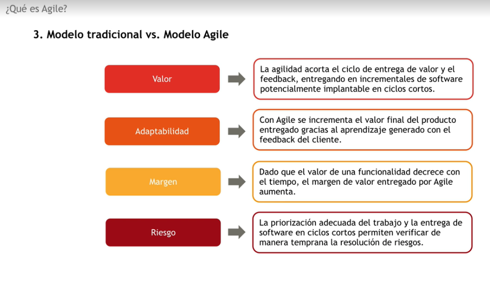
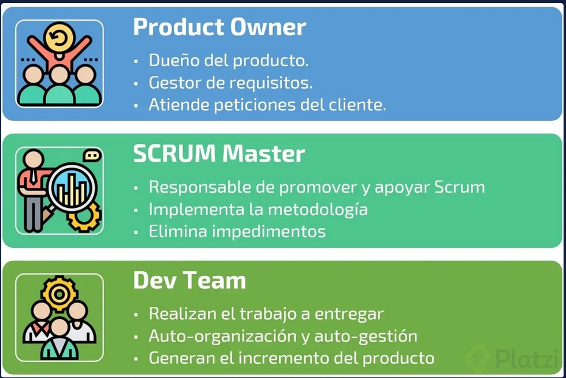
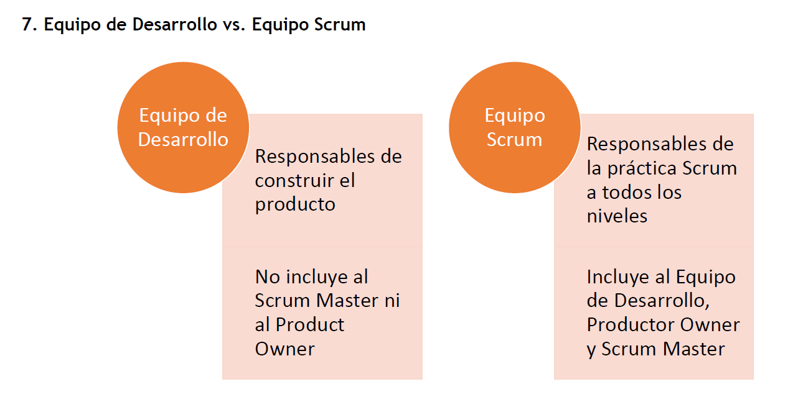
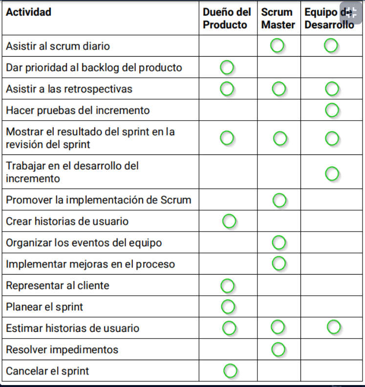
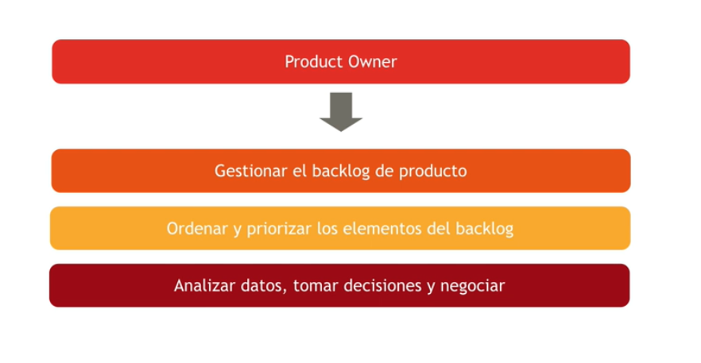
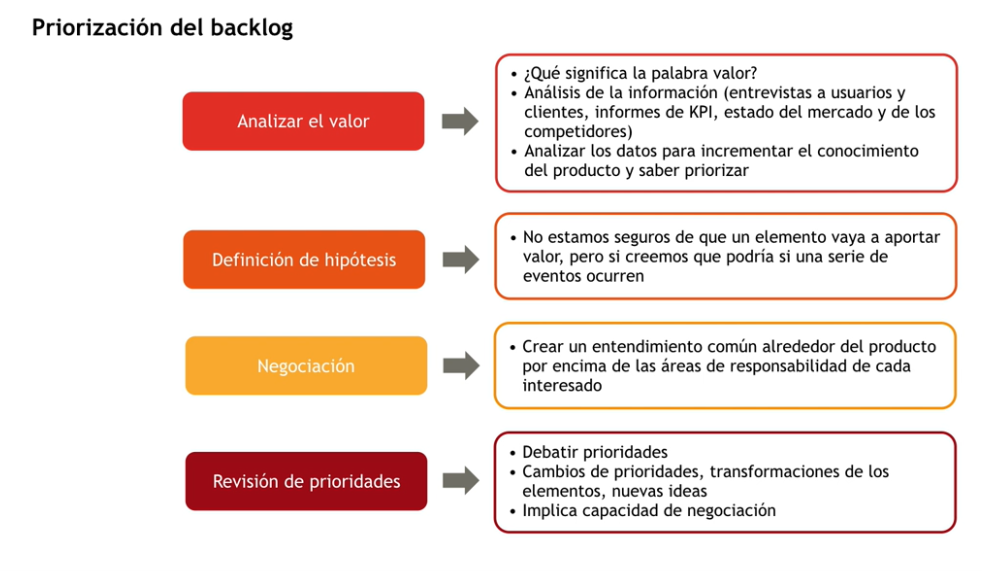
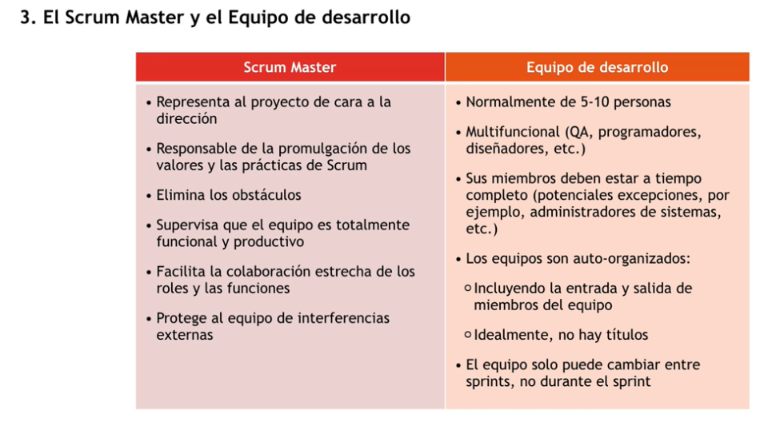
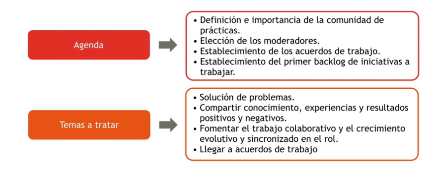
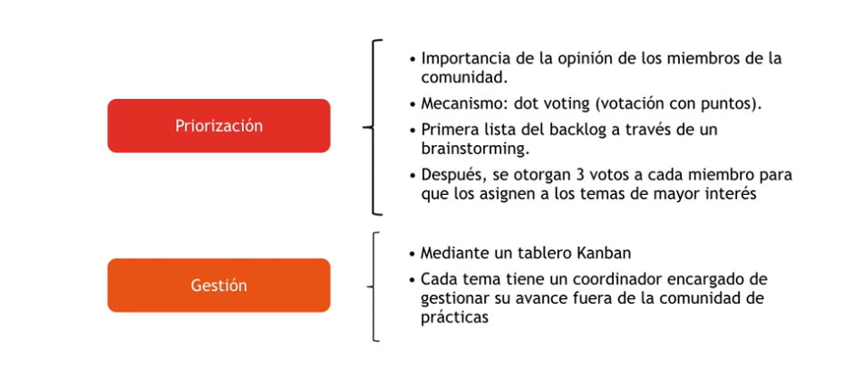
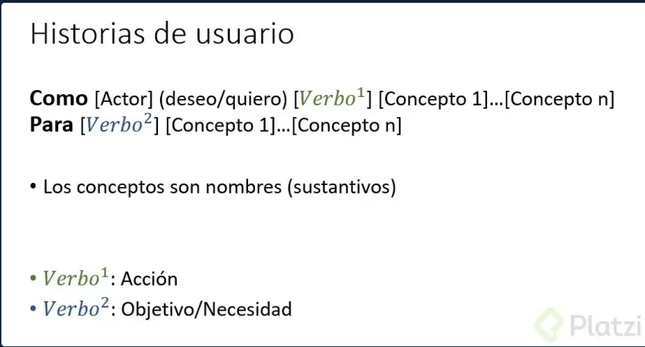

# Módulo 1. Agile y Scrum 

## Unidad 1. Qué es Agile 

### La organización celular

### Qué es agile

Las metodologías ágiles son una filosofía de trabajo que facilita el proceso de creación y entrega de valor continuo en proyectos de desarrollo de software.

Es la habilidad para crear productos y responder al cambio. 
Agile está centrado en las personas.

El principio de Agile se basa en la habilidad para crear productos que responden a las necesidades específicas de un cliente, tomando en cuenta un escenario particular: si las necesidades o los requerimientos del cliente, el negocio o el mercado cambian, el producto se adapta.

Esta capacidad de adaptación al cambio y la entrega de valor constante forman parte de los principios de las metodologías ágiles.

> "Estamos descubriendo formas mejores de desarrollar software tanto por nuestra propia experiencia como ayudando a terceros" - Agile Manifesto

#### Objetivos

- Entender por qué las organizaciones buscan aproximaciones ágiles a la ejecución de proyectos.
- Conocer como *Agile* pretende maximizar la entrega de valor al cliente.
- Aprender cuáles son las principales palancas y barreras para el despliegue de *Agile* en las organizaciones.

### Agile, una palanca para el cambio

1. Reduce el time to market. Reduce el tiempo de producción y desplieuge del producto al cliente final . 
2. Disponer de un producto "clientecéntrico". 
3. Reducir los costes. 
4. Mejora de la calidad de trabajo. Se amplía también su definición como la satisfacción del cliente con el producto. 
5. Facilita la aglidad empresarial. Es la capacidad de una empresa a cambiar frente a factores internos y externos. 
6. Mejora continua. 

### 3. Modelo tradicional vs. Modelo ágil

El alcance de un proyecto/un producto es variable, vamos a estar en continua retroalimentación con el cliente para saber si con las prestaciones que tiene el producto es suficiente para satisfacer sus necesidades/deseos. 

#### Grupos de trabajo 
- Agile propone dividir el equipo en organizaciones celulares multifuncionales y autosuficientes.
- Tiempos de iteración cortos. 
- Iteración: Tiempo de desarrollo de una funcionalidad del producto (p. ejem. 2 semanas). Cada equipo de trabajo va a tener un objetivo claro. 

#### Requerimientos 
- Se genera una lista de requerimientos, que se valida con el cliente y se vuelve la lista de quehaceres. 
- División de los requerimientos en listas más pequeñas para trabajar durante cada iteración
- Objetivos de desarrollo claros

#### Generación del valor. 

Estamos acostumbrados a entregarle al cliente el producto terminado cuando hemos completado la totalidad de la lista de requerimientos y puede que hayan cambios que haya que hacer. En cambio, Agile propone que entregues al cliente el producto al final de la iteración en el estado en el que se encuentra. 

### 12 principios ágiles

12 Principios Agile:

1. Satisfacción al cliente: Entrega de valor al cliente.
2. Cambios: Cambios son bienvenidos. Mientras mas rápido se acepten los cambios.
3. Software funcional: Software que pueda ser usado por el cliente y en periodos cortos de tiempo.
4. Colaboración: Como interactuas y te comunicas con el cliente.
5. Individuos motivados: Dar un buen entorno, independencia y autoridad de tomar sus propias decisiones.
6. Comunicación cara a cara: Método mas eficiente, estar con el cliente y leer su lenguaje corporal.
7. Progreso: El software funcionando es la medida principal de progreso.
8. Desarrollo sostenible: El desarrollo a lo largo del proceso sea constante en cada una de las iteraciones.
9. Mejora continua: Como son iterativas se puede ver que se hizo bien y que se puede mejorar para la próxima iteración.
10. Simplicidad: Priorizar y hacer el trabajo que esta bien definido en ese preciso momento.
11. Auto-organización: Que el equipo sea capas de tomar sus propias decisiones.
12. Auto-evaluación: Que el equipo sea capaz de ajustar y perfeccionar su comportamiento para mejorar.

### 4. Factores a tener en cuenta para implementar Agile 

1. **Dónde está el valor.** Una mentalidad ágil  está convencida en que el valor está en la experimentación o en la adaptación incremental del producto. Si el producto es estático o la experimentación no tiene valor para la empresa, no puede implementar una metodología ágil. 

2. **Las metodologías ágiles requieren dedicación del negocio.** Tener en cuenta la representatividad real de la voz del cliente, ubicación real del uso y del conocimiento

3. **El valor debe poder ser entregado de manera incremental.**  Tener en cuenta si es real construir y validar incrementalmente. Hay que considerar la independencia real del equipo, y si el ciclo real de realización del valor es compatible con la cadencia del proyecto

### 5. Principales retos para implementar Agile

1. Falta de conocimiento. Sesiones de formación de los roles, tanto antes de la constitución de los equipos, como una vez constituidos. 
2. Falta de apoyo de la dirección. Se debe definir desde el inicio los resultados positivos que va a brindar la metología ágil y debe recibir el debido patrocinio de los mandamás. 
3. Dificultad para expanddirse. Agile con un montón de equipos o con equipos grandes es un caos. Se deben utilizar marcos de escalado como SAFE o LeSS. 
4. Tiempo percibido para la transicióh. No hay que usar enfoques casacada para implementar agile. 

### 6. Cómo empezar

Depende del producto que desarrolles debes seleccionar por dónde empezar. También va en función del riesgo a fracasar. 

### 7. Factores críticos del éxito

- La independencia en la entrega de valor de los equipos involucrados, tanto a nivel de equipo individual como de programa ágil.

- La disponibilidad de los clientes/ stakeholderspara dedicarse al proyecto.

- La capacidad real de entregar el valor de manera incremental.

- Sponsoring adecuado para vencer la resistencia interna, cohesionar a la organización en la iniciativa y lidiar con resistencia de los proveedores externos. 

## 2. Roles

- **Project manager**: No existe. Esto no va de proyectos, sino de crear valor. Por un lado está el producto y por otro lado el alcance. Mientras en una metodología nos dedicamos a gestionar el alcance del proyecto,  Scrum se basa en construir un producto de una manera iterativa e incremental. El foco está en el entregable y en el valor y no en las actividades que llevan a conseguirlo. 

Tenemos 3 roles: 
- Product owner 
- Scrum master 
- Equipo de desarrollo 

### Product owner

- Define las funcionalidades del producto. Producto: elemento de valor que vamos a entregarle al cliente. 
- Decide la fecha y contenido de lanzamiento. Es el único que actualiza y modifica el product backlog. 
- Será responsable de la rentabilidad del producto (retorno de inversión).
- Prioriza las características de acuerdo al valor que crean. 
- Ajusta las funcionalidades y su prioridad en cada iteración.
- Acepta o rechaza los resultados. 

### Scrum Master 
El Scrum Master es un líder al servicio del equipo. 

- Responsable de la promulgación de los valores y las prácticas de Scrum.
- Asegura que los objetivos, alcance, y el dominio del producto sean entendidos por todos en el equipo Scrum. 
- Elimina los obstáculos
- Supervisa/facilita/Ayuda que el equipo es totalmente funcional y productivo. Ojo, no es responsable del equipo. 
- Facilita la colaboración estrecha de los roles y las funciones. (Junto con el product owner, definen qué van a construir, mientras que el equipo de desarrollo definen cómo van a construirlo)
- Protege al equipo de interferencias externas. Ayuda a las personas externas al equipo Scrum a entender qué interacciones con el equipo son útiles y cómo deben serlo. 
- Guiar al equipo de Desarrollo a ser auto-organizado y multifuncional. 
- Ayuda al DevTeam a crear productos de alto valor. 

### Equipo de desarrollo 

- Normalmente de 3-9 personas (cantidad de personas que podrían comer 2 pizzas grandes enteras). 
- Multifuncional (contiene todos los roles necesarios)
- LOS miembros deben estar a tiempo completo
- No existen jerarquías ni sub-equipos. 
- Los equipos son auto-organizados (incluyendo entrada y salida de miembros)
- El equipo solo puede cambiar entre Sprints (no durante el sprint)

### 7. Equipo de desarrollo vs. Equipo Scrum

### 8. Qué vs. Cómo

En un modelo tradicional el project manager debe decidir qué y cómo hay que construir el proyecto. 

En Scrum, eso está diferenciado en dos roles. 

El product owner, conoce el negocio, sabe priorizar las funcionalidades y puede estimar el impacto que van a tener en el cliente. No es un técnico ni especialista para desarrollar/construir el producto, él conoce el negocio. Es el equipo de desarrollo quien tiene esa responsabilidad. 

El Scrum Master, vela por las buenas prácticas, resolver los bloqueos/obstáculos que el equipo de Desarrollo se enfrente, y asistir al Product Owner en la búsqueda de la maximización del valor entregado al cliente. 

### Tips

- El equipo de desarrollo puede expulsar a miembros del equipo salvo que produzca un impedimento, donde el Scrum Master tiene que resolverlo. 
- El Analista Funcional no es el Product Owner, el Analista Técnico no es el Product Master. No existen equivalencias en Scrum para estas posiciones. 
- Tareas tales como  aseguramiento de la calidad, la experiencia de usuario, arquitectura empresarial son responsabilidades de todo el equipo de desarrollo.  Son nuevas competencias a añadir además de las competencias necesarias para entregar el mejor producto, y son competencias compartidas en igual medida. 
- El Scrum Master no es el responsable del equipo. Es un coach que ayuda al equipo a tomar las mejores decisiones.
- No obstante, no todas las decisiones están en manos del equipo de desarrollo. Todos los eventos y artefactos Scrum no son opcionales y el equipo aquí no es autónomo. 

## 3. Roles y responsabilidades en un entorno ágil 

### El product owner

- Define las funcionalidades (el qué) del producto
- Decide la fecha del lanzamiento del sprint y/o la versión y el contenido
- Será responsable de la rentabilidad del proceso (ROI).
- Define y prioriza las funcionalidades de acuerdo al valor que aportan al cliente. 
- Ajusta las funcionalidades y su prioridad en cada interacción. 
- Acepta o rechaza los resultados. 

Para tener autoridad sobre algo debo ser responsable del producto. 
Si puedo decidir también tengo accountability. 

#### El product owner y la priorización del backlog 

**¿Qué es el backlog?** --> 

### Priorización del backlog

### 3. El scrum master y el equipo de desarrollo 

### 4. El agile y la mejora continua

Uno de los principios ágiles es buscar la mejora continua. Para ello se deben compartir tanto las buenas como las malas prácticas. 

Dentro de los equipos Scrum, esto puede realizarse tanto en los Daily Scrum como en las Retrospectivas de Sprint, pero ¿cómo se hace entre células organizacionales? --> por medio de Comunidades de Prácticas. 

### 5. Comunidad de prácticas 

Es un grupo de personas que desempeña **el mismo rol o responsabilidad profesional desde la experiencia, no la opinión**, que profundiza en un conocimiento o pericia en un asunto a través de una interacción continuada. 

#### Estructura
- **Moderador**. Se asegura que las actividades se lleven a cabo y promueve la participación de los miembros. 
- **Líder**. Tiene claro hacia donde quiere llevar la comunidad. 
- **Miembros**. Participan activamente, generan ideas, dan feedback. 

#### Cómo funciona una comunidad de prácticas 

Se inicia en una fundación, consiste en una reunión de 2 horas. 

#### Cómo se gestiona y prioriza el backlog en una comunidad de prácticas 

Sin una comunidad de prácticas es imposible escalar una metodología ágil e implementar mejora continua. 

## Unidad 3. Inicio ágil de proyectos
Los objetivos son: 
- Conocer en qué consiste el Inception Deck

les. 

### Inicio ágil de proyectos (Inception deck)

#### Qué es

> Agile Inception, también conocida como Inception Deck o simplemente Inception, es un conjunto de dinámicas orientadas a enfocar a todas las personas involucradas en un proyecto hacia un mismo objetivo, reduciendo muchas de las incertidumbres, ayudando a explicitar los riesgos más evidentes y poniendo en común las expectativas de todos”.

Es similar a lo que se conoce en una metodología clásica como el *kickoff* de un proyecto, aplica para cualquier metodología no solo para los proyectos ágil. 

Roles que participan en un Inception Deck

#### Secuencia de actividades

1. Introducción al proyecto. *Why are we here* 
2. Explicar el proyecto. *Elevator pitch*
3. Diseñar el *Product Box*
4. Acotar el alcance. *NOT list*
5. Identificar stakeholders.  *Meet the neighbors*
6. Explicar el alcance. *Show the soluction* 
7. Identificar riesgos. *Up at night*
8. Estimar el proyecto. *Size it up*
9. Acordar las prioridades. *Trade-off*
10. Planifica el proyecto. *User Story Mapping*

## Unidad 4. Principios de Scrum y Eventos

### Principios de Scrum 

### Objetivos
1. Introducir los conceptos fundamentales de Scrum 
2. Profundizar la importancia de la reducción del riesgo que aportan las metodologías ágiles gracias a su enfoque iterativo-incremental. 
3. Conocer el concepto de Sprint y la diferencia con el concepto de *versión*. 

### Un poco de Historia 

- En 1986, un grupo de japoneses describieron una nueva aproximación al desarrollo de productos comerciales a la que denominaron "aproximación holística o del rugby". 
- En 1991, DeGrace y Stahl se refieieron por primera vez a esta aproximación como *Scrum*. 
- En 1995, Sutherland y Schwaber presentaron un artículo describiendo la metodología Scrum. 
- En 2001, Schwaber y Beedle escriben el primer libro, "Agile Software Development with Scrum". 

### ¿Qué es Scrum?

Un Scrum en el rugby, es cuando todo el equipo colabora por obtener el balón. 

 Se centra en entregar el mejor producto en el tiempo más corto. 

Es un marco de trabajo por el cual las personas pueden abordar problemas complejos adaptativos, a la vez que entregan productos del máximo valor posible productiva y creativamente. 

- Entregar el mejor producto producto lo más rápido posible. 
- Una de las claves de Scrum es que es un equipo pequeño (3-10 personas). Esto es para preservar que sea altamente flexible y adaptativo. 
- Cada iteración despliega un producto funcional, listo para que el cliente lo use 
- El equipo se auto-organiza para determinar la mejor manera de entregar el trabajo. 
- En cada iteración, todo el mundo puede ver el producto funcionando. 

### ¿Por qué Scrum?

Mitiga el principal riesgo de que el producto no le aporte valor o no sea atractivo para el cliente. 

### Teoría de Scrum 

Se basa en la teoría de control de procesos empírica: el conocimiento procede de la experiencia. 

Los pilares de Scrum son: 
- Transparencia
- Inspección
- Adaptación

Los valores de Scrum son: 
1. Compromiso. En la iteración total del proyecto, no solo en sus tareas directas. 
2. Coraje. 
3. Enfoque. 
4. Apertura. 
5. Respeto. 

##### Componentes de Scrum 

1. **Equipo:** Es auto-organizado y multifuncional. Auto-organizaddo porque decide cómo cumplir los objetivos del producto que tiene asignado, y es multifuncional porque puede ejecutar todas las tareas necesarias independientemente, como una célula. 
    - Product owner. 
2. **Ceremonias:** Existen eventos periódicos con duraciones puntuales con el fin de crear regularidad y minimizar las reuniones innecesarias. 
    - Sprint: Las iteraciones delimitadas en un periodo del tiempo donde el equipo trabaja una parte del producto. 
    - Planificación del sprint: Ceremonia para definir los entregables y metas para el sprint. 
    - Daily Scrum: Reunión diaria de todo el equipo de desarrollo. 
    - Sprint Review: Se muestra el incremento desarrollado durante el sprint. 
    - Sprint retrospective: El equipo se autoevalúa su trabajo, diciendo qué se hizo bien y en qué se podría mejorar para tener un proceso de mejora continua. 
3. **Artefactos:** Son elementos que representan en qué consiste el producto, qué es lo que quiere el cliente, en qué estamos trabajndo.  Son útiles para proporcionar transparencia, visibilidad y oportunidades para la inspección y adaptación. 
    - Lista de producto (Product backlog). Es una lista ordenada e incremental que recoge todos los requerimientos del producto. 
    - Sprint Backlog. Es un subconjunto del product backlog que se va a trabajar en un sprint determinado. 

### Iteraciones y versiones

Versión: es una unidad del producto puesta en entrega al cliente. 
Iteración: Es una entrega del producto que potencialmente puede ser una versión. 
Sprint: Es el contenedor donde se desarrolla la práctica de Scrum. El sprint es una iteración. 

### Ceremonias / Eventos 

Scrum define cinco ceremonias principales para cumplir con el control de sus procesos, todas con un sentido de ser propio que hace que sean imprescindibles para esta metodología.

#### Concepto de timeboxing

Los tiempos de las dinámicas son fijos, y con ello se busca aumentar el enfoque de los participantes. 
De manera general, en Scrum, los eventos finalizan cuando se cumplen los objetivos o cuando se llega al límite de tiempo especificado. 

#### Eventos
Es cualquier ceremonia enfrascada por un timeboxing. Es por ello que los eventos también se consideran *contenedores*. 

1. Sprint
2. Daily Scrum 
3. Sprint Planning
4. Sprint Review 
5. Sprint Retrospective

#### Sprint 
- Los proyectos que utilizan SCRUM avanzan en una serie de iteraciones llamados Sprints. 
- La duración gira en torno a 4 semanas o menos. De cara a la certificación no hay una duración normalizada.
- Una duración constante de los sprints ayuda a mantener el ritmo del progreso. Todos los sprints del proyecto deben tener la misma duración. 
- El producto se diseña, se construye y se prueba en el mismo sprint. 
- Todo Sprint debe tener objetivo de entrega de valor: el Sprint Goal. 
- SI los objetivos del Sprint quedan obsoletos podría ser cancelado. 
- Solo el PO tiene la autoridad para cancelar un Sprint. 

##### Sprint Planning

El Sprint Planning es una reunión que se realiza al comienzo de cada Sprint donde participa el equipo Scrum al completo; sirve para inspeccionar la pila del Producto (Product Backlog) y que el equipo de desarrollo seleccione los elementos de la pila del producto en los que va a trabajar durante el siguiente Sprint. Estos items son los que compondrán el Sprint Backlog.

Si bien en el Sprint Planning participa el equipo Scrum al completo, no participan los stakeholders. En el Sprint Planning se inspecciona la pila del producto, los *acuerdos de la Retrospectiva*, la *capacidad* y la *Definition of Done* y se adaptan el *Sprint Backlog*, *Sprint Goal* y el plan para poder alcanzar ese *Sprint Goal*.

**El Sprint Planning se divide en dos partes.** En la primera parte de la reunión se trata Qué se va a hacer en el siguiente Sprint y, en la segunda parte, se discute el Cómo. La primera parte está organizada y liderada por el product owner, mientras que de la segunda parte se encarga el Development Team. La única labor del Scrum Master es asegurarse de que la reunión existe como parte de Scrum y que se mantiente dentro de las duraciones estimadas.

El Sprint Planning no puede durar más de 8 horas para Sprints de 4 semanas. En la práctica esta ceremonia suele llevar una mañana completa -alrededor de 5 horas- y, sólo si el producto o el Sprint definido por el Product Owner son complejos o están poco claros, se llegan a alcanzar las 8 horas definidas en la metodología. La razón del Sprint Planning es conseguir alineamiento entre negocio y desarrollo de producto en relación a las prioridades.

 

La Sprint Planning responde a lo siguiente:

    ¿Qué se puede entregar en el Incremento resultante del próximo Sprint?
    ¿Cómo se logrará el trabajo necesario para lograr el Incremento?

El trabajo en el Sprint Backlog no es un compromiso, es un pronóstico (forecast).
Normalmente, el Sprint Planning lo dirige el Scrum Master pero la idea es que el rol de moderador sea rotativo.
El único contenedor de un Sprint es su caja de tiempo (timebox), no el trabajo planeado para el Sprint.

En resumen, los pasos a seguir son: 
1. Elementos del product backlog que vamos a hacer en el sprint
2. Estimación de esfuerzos
3. Capacidad del equipo con la velocidad de los sprints anteriores. 
4. Objetivos para el siguiente sprint.

#### Daily Scrum

El Daily Scrum, conocido comúnmente sólo como “La Daily”, es una reunión diaria de 15 minutos en la que participa exclusivamente el Equipo de Desarrollo.

En esta reunión todas y cada una de las personas del Equipo de Desarrollo responden a las siguientes preguntas:

    ¿Qué hice ayer para contribuir al Sprint Goal?
    ¿Qué voy a hacer hoy para contribuir al Sprint Goal?
    ¿Tengo algún impedimento que me impida entregar?

#### Sprint Review 

El Sprint Review es la reunión que ocurre al final del Sprint, generalmente el último viernes del Sprint, donde el product owner y el Develpment Team presentan a los stakeholders el incremento terminado para su inspección y adaptación correspondientes. En esta reunión organizada por el product owner se estudia cuál es la situación y se actualiza el Product Backlog con las nuevas condiciones que puedan afectar al negocio.

El equipo ha pasado hasta cuatro semanas desarrollando un incremento terminado de software que ahora mostrará a los stakeholders. No se trata de una demostración, sino de una reunión de trabajo. El software ya ha sido mostrado y validado junto con el product owner previamente a esta reunión.

Por un lado, se revisará el incremento terminado. Se mostrará el software funcionando en producción y los stakeholders tendrán la oportunidad de hacer cuantas preguntas estimen oportunas sobre el mismo. El software funcionando ha sido validado previamente por el product owner, que se ha encargado de trabajar con el equipo durante el Sprint para asegurarse que cumple con la Definition of Done y, efectivamente, hace que el Sprint Goal sea válido.

El Development Team tiene que tener un papel importante en esta reunión. Muchas veces no es el product owner quien demuestra el incremento producido, sino que son los propios miembros del Development Team quienes lo hacen. Es una buena práctica no sólo el que lo lleven a cabo, sino también el que lo hagan de forma rotatoria y, tras varios Sprints, hayan participado todos.

El equipo de desarrollo comenta posteriormente qué ha ocurrido durante el Sprint, los impedimentos que se han encontrado, así como soluciones tomadas y actualizan a los stakeholders con la situación del equipo. Por último, el product owner actualiza -con la información de negocio recibida en esta reunión- el Product Backlog para el siguiente Sprint.

#### Sprint Retrospective

La retrospectiva ocurre al final del Sprint, justo después del Sprint Review. En algunos casos y por comodidad de los equipos, se realiza conjuntamente con el Sprint Planning, siendo la retrospectiva la parte inicial de la reunión.

El objetivo de la retrospectiva es hacer de reflexión sobre el último Sprint e identificar posibles mejoras para el próximo. Aunque lo habitual es que el Scrum Master sea el facilitador, es normal que distintos miembros del equipo Scrum vayan rotando el rol de facilitador durante la retrospectiva.

Un formato común es analizar qué ha ido bien durante el Sprint, qué ha fallado y qué se puede mejorar. Este formato se puede facilitar pidiendo a los miembros del equipo Scrum que escriban notas –en post-its- para luego agruparlas y votar aquellos ítems más relevantes, dando la oportunidad a todos de hablar y expresar sus inquietudes.

También se utiliza el formato de retrospectiva basado en cinco fases:

1. Preparar el ambiente: un pequeño ejercicio para romper el hielo.
2. Recolectar información: durante esta fase, se utilizan actividades para intentar construir una imagen de lo que ha sido el último Sprint, resultando una imagen conjunta de equipo.
3. Generación de ideas: el equipo intenta generar ideas para identificar acciones que ayuden a mejorar el rendimiento del equipo durante el siguiente Sprint.
4. Decidir qué hacer: de las ideas generadas, se proponen acciones que el equipo pueda implementar en el próximo Sprint.
5. Cierre: Una pequeña actividad de cierre, normalmente unida a una evaluación de la propia retrospectiva, ayuda al equipo a decidir hacia dónde dirigirse en próximas ocasiones. Un recordatorio de la mejora continua.

La duración recomendada por Scrum para un Sprint de 4 semanas es de un máximo de 3 horas, aunque habitualmente se destina entre 1 y 2 horas a este evento.

#### Sprint Retrospective vs. Sprint Review

#### Tabla Resumen Scrum

# Módulo 5. Artefactos y Ejecución de Scrum

## Artefactos

1. Conocer los diferentes elementos y niveles de detalle que presenta el producto en Scrum

2. Integrar los concepto de entrega iterativa incremental y de refinamiento de Scrum

3. Entender los diferentes artefactos de la metodología Scrum

##  Definición de producto en Scrum 

En los enfoques de proyectos tradicionales, se habla de alcance para referirse al contenido de un proyecto, que incluye el producto, servicio o resultado esperado
En las metodologías ágiles no se habla de alcance, sino de producto Con esto se busca poner el foco en el entregable al cliente, más que en las actividades necesarias para conseguirlo. 

## Product backlog o pila de Producto

- Es una lista de todo el trabajo que hay que hacer en el proyecto
- Es una lista priorizada por el Product Owner
- Puede cambiar y ser re priorizada antes de cada Sprint Planning
- El criterio para priorizar es el valor que el Product Owner considera que tiene un elemento para el cliente
- Puede contener elementos con diferente nivel de definición y detalle (P.E. épicas e historias de usuario). 

### Historia del Usuario

Son los elementos más específicos del product backlog, contienen la visión del usuario en cuanto a la funcionalidad del producto.  No debemos confundirlas con requerimientos, ya que son las historias que el usuario nos está contando. 
- ¿qué quiere hacer el usuario con nuestro producto? 
- No tiene que ser una persona, puede ser una parte del sistema. 

#### Componentes de la historia de usuario
- **Título**: Permite conocer rápidamente de qué se trata la historia y por ello debe ser concreta y clara.
- **Descripción:** Contiene información sobre cómo se deben ejecutar las tareas, puede incluir componentes técnicos, especificar el tipo de diseño, el lugar donde se van a almacenar las tareas o el flujo de arquitectura que se debe seguir. En resumen, contempla una definición más específica para completar la historia.
- **Puntos.** El esfuerzo que le va a tomar al DevTeam completar las actividades. No tienen una unidad de estimación, se basa en la experiencia del equipo. Se utiliza la dinámica de *planning poker* (se explicará más adelante. )
- Criterio de aceptación. Definen los requisitos que la historia debe cumplir para que esté completa.

> Como <rol> Quiero <acción> para que <beneficio>

#### Completado 

La definición de “completado” en una Historia de Usuario debe incluir la lista de elementos requeridos. Este es un ejemplo:

- Funcionalidad (que se cumplan los criterios de aceptación)

- Sistema de gestión del código o de versiones (código actualizado en git)

- Pruebas creadas (unitarias, funcionales, de rendimiento)

- Documentación (a través de manuales o tutoriales)

#### Las 3 Cs
Antes de comenzar la planeación del sprint se debe de invertir tiempo en la planeación de las Historias de Usuario. Existe una técnica llamada las tres C (por sus nombres en inglés):

1 Cards o Tarjetas.  Son las tarjetas creadas con los componentes o información de cada historia.
2. Conversation. Es la conversación del equipo acerca de la historia, para asegurar que no haya dudas en el proceso de desarrollo.
3. Confirmation. Todas las personas que trabajan en la historia llegan a un acuerdo y confirman que entienden su contenido.

#### Cómo debe ser una buena Historia de Usuario

I - Independiente. No debe depender de otra Historia de Usuario. Si es así, debe marcarse con tiempo y no se debe empezar a trabajar hasta que se complete su dependencia.

N - Negociable. Si el equipo encuentra que la historia es muy grande para completarla durante el sprint, se puede negociar con el Product Owner para dividirla en historias más pequeñas.

V - Valiosa. Debe entregar valor al cliente, debe hacer algo por la funcionalidad o el producto.

E - Estimable. Se debe poder estimar el esfuerzo para completar la historia.(debe producir la sensación de que cuando se termina está produciendo un valor)

S - Small (pequeña). Debe ser lo suficientemente pequeña para cumplir una funcionalidad. 

T - Testeable (comprobable). Se debe verificar que la historia se completó a través de los criterios de aceptación y de la definición de completado.

#### Cómo estimar una historia de Usuario 

Para estimar Historias de Usuario en un proyecto Scrum se deben tener en cuenta 4 elementos:

1. **Complejidad de la historia.** Junto con el equipo se debe definir qué tan difícil es implementar la historia
2. **Cantidad de trabajo requerido.** Representa el esfuerzo que debe invertir el equipo para llevar a cabo la historia.
3. **Conocimientos necesarios.** Habilidades técnicas, de diseño y de negocio, entre otras, para completar la historia.
4. **Incertidumbre.** Acciones que se requieren para ejecutar la Historia de Usuario, aunque no se tenga claro el tiempo o esfuerzo real.

El proceso de estimación de las Historias de Usuario se hace a través de puntos. Estos puntos no están relacionadas con una escala de medición, no representan horas o días de trabajo, sino un estimado empírico con base en la experiencia del equipo.

##### Qué es el póker de planeación o planning poker

El planning poker es una herramienta que sirve para que el equipo de un proyecto Scrum participe en la estimación de las Historias de Usuario.

Existen cartas físicas de planning poker pero, en caso de no tenerlas, también se puede hacer uso de aplicaciones como Scrum Poker Cards, disponible en PlayStore.

Los puntos para hacer la estimación se pueden establecer tomando como referencia diferentes escalas:

-Una de las más usadas es Fibonacci modificada (1, 2, 3, 4, 8, 13, 20, 40, 100, ∞ y ? → representa incertidumbre)
- 2X (1, 2, 4, 8, 16, 32)

La idea de usar estas escalas en lugar de números consecutivos es minimizar el tiempo que se puede perder en discusiones triviales o que no permitan dar continuidad al proyecto.

Al final del proceso de estimación, se obtendrá el valor total de puntos de todas las Historias de Usuario y eso va a reflejar:
- Velocidad. Es el total de puntos de las historias de usuario completadas por el equipo durante un sprint.
- Capacidad. Total de historias de usuario que se pueden completar en un sprint futuro.

Durante el primer sprint es posible identificar la velocidad del equipo y con base en los resultados, será más fácil estimar los próximos sprints.

### Del Sprint Goal al Sprint Backlog

### Sprint Backlog o pila del Sprint

El Backlog del Sprint (lista de pendientes del Sprint) es un subconjunto de la lista del producto y contiene todos los elementos que serán desarrollados durante el Sprint.

De estos elementos dependerá el incremento a desarrollar y los objetivos del Sprint.

El Backlog del Sprint dependerá de las diferentes etapas de desarrollo. En él se incluye el flujo de proceso para cada Historia de Usuario, según el estatus en el que se encuentre.

Este sistema se puede gestionar en un espacio físico como una pizarra, pero también a través de herramientas digitales como Trello (gratuito) o Jira (de pago).

- En el Sprint Planning , el Equipo Scrum analiza el objetivo del Sprint (Sprint Goal ) y decide que tareas hay que hacer para alcanzarlo.
- El Product Owner prioriza los elementos del Product Backlog por valor para el cliente
- El Equipo de Desarrollo se auto organiza , seleccionando los elementos del Product Backlog buscando maximizar el valor y cumplir el Sprint Goal . Esos elementos constituyen el Sprint Backlog. 

#### Características del Backlog del Sprint

Estas son algunas características que se deben tener en cuenta para la lista de pendientes del sprint:

- Contemplar un plan lo suficientemente detallado para que todo el equipo esté en capacidad de comprenderlo en los daily stand-ups (Scrum diario).
- Asegurar que todas las personas que participan en el Scrum diario tengan conocimiento del Sprint Backlog.
- El dueño del Backlog del Sprint es el equipo de desarrollo, por lo tanto, tiene potestad sobre esta lista para aceptar o no que se agreguen elementos al Sprint Backlog.
- Si un elemento se vuelve innecesario a mitad de un sprint se puede sacar de la lista de pendientes.
- El Product Owner podrá dialogar con el equipo de desarrollo para bajar la prioridad de una historia o incluso eliminarla.

#### Cómo se definen las prioridades del Backlog del Sprint

Se sugiere tomar en cuenta los siguientes criterios para dar prioridad a las Historias de Usuario que forman parte de la lista de pendientes del Sprint:

- Valor para el cliente. Enfocarse en historias que generen más valor al producto.
- Urgencia. Por ejemplo, cuando una historia tiene una fecha para que se pueda utilizar o integrar al sistema.
- Riesgo / Oportunidad. Definir el impacto que la realización de una historia podría tener en el avance del proyecto o en la ejecución de nuevas historias.
- Esfuerzo. Qué tanto esfuerzo se requiere por parte del equipo para ejecutar la historia.

### El concepto de incremento

El Incremento es la suma de todos los elementos de la Lista de Producto completados durante un Sprint y el valor de los incrementos de todos los Sprints anteriores.

### Definition of Done

- Es un acuerdo del Equipo Scrum que contiene todas condiciones que deben cumplir los ítems del Sprint Backlog para considerarlos completados
- Cada Equipo Scrum crea y mantiene su propia Definición de hecho, que suele evolucionar y refinarse con el tiempo
- La entrega formal del producto se realiza en el Sprint Review . En caso de no llegar a acuerdo puede utilizarse la Definition of Done para saber si el elemento del Sprint backlog está finalizado o no
- El refinamiento de la Definition of Done se realiza en la Sprint Retrospective. 

#X# 3 Cómo medir el avance de un proyecto Scrum

El propósito de medir el avance de un proyecto Scrum es que el equipo pueda analizar el progreso y revisar si aún se puede cumplir el objetivo planeado al inicio de la iteración. ¿Cómo se logra esto? → Con base en los puntos de las Historias de Usuario.
3 gráficas para medir las Historias de Usuario

Las siguientes 3 gráficas facilitan el proceso de medición del avance de un proyecto Scrum, tomando como base los puntos de las Historias de Usuario:

#### Gráfica de trabajo pendiente o Burn Down Chart. 

Este tipo de gráfica está enfocada en el sprint y hace visible el trabajo pendiente durante del desarrollo de un proyecto. Además, permite identificar la velocidad con la cual se están alcanzando los objetivos propuestos y si el equipo puede cumplir con el total de las actividades estimadas.

- Idealmente debería llegar a cero al final del Sprint
- El sprint backlog puede crecer si el Equipo de Desarrollo incluye nuevas tareas en el Sprint

- Los puntos estimados para el Sprint: 100.
- El Sprint cuenta con 10 días.
- Se marcan dos líneas: una, la estimada por el equipo y dos, la real (trabajo efectivo del equipo).
- En la columna “completado” se muestra el avance del equipo.
- En la columna “pendientes” se puede ver lo que todavía no se ha realizado.
- A medida que se registran los avances, la línea gris permite conocer la tendencia.
- Al finalizar el Sprint y completar los datos, se pueden ver las diferencias entre el trabajo estimado versus el ejecutado.
- En tal caso que el progreso real no llegue a cero es posible definir o estimar las tareas que faltan para el siguiente Sprint.

#### Bourn Up Chart 

Esta gráfica permite ver el trabajo que se ha completado durante el Sprint. Se marca una línea adicional (de color amarillo) la cual representa el ideal de puntos que se deben completar o el objetivo al que se quiere llegar.

En el momento en que la línea roja alcance a la línea amarilla, se ha cumplido el objetivo del Sprint. Si esto sucede antes de tiempo estimado, es una oportunidad para que el equipo revise oportunidades de mejora o prepararse para la Revisión del Sprint (Sprint Review).

#### Gráfica de flujo acumulado 

En esta gráfica no se refleja el día a día del Sprint, sino que incluye el histórico de los Sprints anteriores.

 En este ejemplo es posible observar:

- Los estados del progreso de desarrollo (pendiente, progreso, QA (Quality Assurance) y completado).
- La línea de pendientes (verde) se va acumulando en el tiempo, ya que mientras el proyecto esté activo, se agregarán más historias en cada Sprint.
- Es posible analizar en cuánto tiempo se completan actividades que inician en un Sprint determinado.
- La gráfica permite identificar cuellos de botella y analizar las razones por las que se generan.

### Claves para el examen de la certificación 

- El Sprint Backlog puede modificarse durante el Sprint, pero solo bajo criterio del equipo de desarrollo
- El concepto de incremento es contraintuitivo. No se refiere al nuevo producto que se incorpora tras un Sprint, sino el total de producto entregado hasta el momento.
- El Product Backlog lo prioriza el Product Owner mientras que el Sprint Backlog lo prioriza el Equipo de Desarrollo atendiendo a la prioridad otorgada por el Product Owner a los elementos del Product Backlog
- El equipo puede empezar a trabajar desde el momento que tiene algunos elementos priorizados en el Sprint Backlog, en el caso de que en el Sprint Planning no haya dado tiempo a priorizar todo el Sprint Backlog
- La Definition of Done no tiene dueño, pertenece a todo el equipo, ya que es un acuerdo de trabajo, si bien debe seguir los criterios expresados por el Product Owner. 

## Ejecución de Scrum 

### Objetivos 

1. Introducir los conceptos fundamentales en la ejecución con Scrum 
2. Profundizar en las herramientas visuales que utiliza Scrum para el seguimiento de la ejecución 

### En qué consiste la ejecución 

Es la sucesión de actividades que se realizan para entregar valor al cliente en forma de producto. 

Consiste en la realización de las tareas que completan las historias de usuario que se incluyen en el Sprint Backlog de la iteración en curso. 

### Seguimiento durante la ejecución. 

1. Seguimiento de las tareas: Reunión diaria: daily Scrum/Tablero Kanba 
2. Seguimiento de las historias de usuario: Tablero Kanban
3. Seguimiento de la iteración (sprint): Gráfico de trabajo pendiente (Burndown chart).
4 Seguimiento de la versión (release): Gráfico de quemado ascendente (Burnup chart). 

### Seguimiento de Historias de Usuario

Un tablero Kanban representa un flujo de trabajo que permite realizar un seguimiento visual de los elementos que transitan por dicho flujo (en este caso las historias de usuario). 

Esta forma de trabajar permite que la información esté compartida y se detecte de forma sencilla los cuellos de botella que se producen en el proceso. 

**Artefacto**: Es un elemento de Scrum que permite tangibilizar una actividad. 

# Unidad 6 

## Introducción al Escalado Ágil con SAFE

1. Objetivos
2. El concepto de Agilidad Empresarial
3. Agilidad Empresarial vs Agile
4. Qué es SAFe
5. El concepto de Release Train
6. Niveles de SAFe
7. Roles de SAFe
8. Iteraciones, Incrementos y Alineamiento en SAFe

### 1. Objetivos

- Conocer el concepto de escalado y su importancia para la Agilidad Empresarial
- Integrar los concepto de Agile e Agilidad Empresarial y sus principales palancas
- Entender los principios del marco de trabajo SAFey las estrategias para su implantación

### 2. El concepto de Agilidad Empresarial

Elconcepto de Agilidad Empresarial hacere ferenci a a la habilidad que poseen las organizaciones para responder y adaptarse a los cambios.

Para que consiga un impacto práctica es importante que trabajen 3 dimensiones: 

### 3. Agile vs. Agilidad Empresarial 

### 4. Qué es SAFe

### 5. El Concepto de Release Train

SAFe entrega valor de manera paulatina como un tren. 

El Agile Release Train(ART) hace referencia a un modo de planificar la entrega de producto según un calendario predeterminado y regular, como si de un «horario de trenes» se tratara.
Este calendario es público para todos los equipos que deben contribuir a la entrega y representa un compromiso por su parte, pues el calendario debe ser cumplido
Si usamos la metáfora: «el tren sellevará a los pasajeros que estén listos para viajar», es decir se integrará sólo el producto que esté listo para ser integrado. 

### 6. Niveles de SAFe

SAFe propone diferentees niveles a la hora de gestionar el escalado, que se agregan unos dentro de otros: 

#### Equipo 

El equipo ágil es el elemento básico de SAFe. Con carácter general, los equipo ságiles de delivery (en los que se centra SAFe) pueden presentar dos arquetipos: 

1. Arquetipo Scrum
    - PO
    - Scrum Master
    - Dev Team
2. Arquetipo Kanban. 
    - PO
    - Dev team

#### Programa 

Esta estructura está formada por equipos de equipos, cuya musión es asegurar el ART. Esta estructura es auto-organizada, planifica, compromete y ejecuta junta, compartiendo una misión común. Un pogrma es un tipo de organización virtual, consittuida por entre 5 a 12 equipos ágiles. 

Esta estructura incorpora una serie de roles adicionales al equipo. 

#### Portfolio 

Este nivel aúna diferentes programas alrededor de una cadena de valor. Los temas estratégicos, el presupuesto y la gestión del portafolio (PPM) se organzian en este nivel. 

### Roles de SAFe

#### Nivel Equipo 

#### Roles de SAFe: Nivel programa

1. Release Train Engineer: Hace la función de Scrum Master en el nivel de progrmaa, ayuda a los equipos a que sean auto-organziados y autogestionados. Sus principales funciones son solucionar impedimientos de los equipos y scrum masteres de nivel de equipo, además de facilitar varias reuniones entre las que destaca el scrum de scrums. 
2. System Architect: gestiona la parte técnica y arquitectónica de las features, conoce y ayuda a definir la tecnología más apropiada para este nivel y participa en la definición de requisitos funcionales, no funcionales y features. Además, facilita y ayuda a los equipos para que trabajen cómodos con la tecnología elegida. 
3. Product Management: Es el PO a nivel de programa, coordina a los product owners de cada equipo. El Product Manager conoce las caraterísticas de la solución a desarrollar y las necesidades de los clientes, así que se encarga de descomponer las Epics en Features y mantener y priorizar el Program Backlog. Además se encarga de crear el roadmap. 
4. Business Owner: Son un grupo de ejecutivos con responsabilidades financieras del resultado de la solución implementada, es decir, son los encargados de hacer que se cumpla el ROI que se ha hecho para desarrollar la solución, y se encargan de conectar el nivel de programa con el portfolio. 

#### Nivel Portfolio 

1. Epic Owner: Es responsable de coordinar las Épicas del Portfolio a través del sistema Kanban de gestión del Portfolio. Al respecto es responsable de definir la Épica, su producto mínimo viable (MVP), así como asegurar la implanttación de este tras su aprobación. 
2. Enterprise Architect: Promueve el diseño adaptativo y las prácticas de ingeniería e impulsa iniciativas de aruitectura a nivel de Portfolio. Además, las personas que desempeñan este rol también facilitan la reutilización de ideas, componentes, servicios y patrones probados en varias soluciones a nivel de Portfolio. 
3. Lean Portfolio Management: Es la persona que tiene el nivel más alto en la toma de decisiones y ostenta responsabilidad financiera sobre los productos y soluciones en un Portfolio SAFe. Es un business owner de business owners. 

### 8. Iteraciones, Incrementos y Alineamiento en SAFe

Son análogos a los Sprints de Scrum. AL tener diferentes equipos realizando Scrum de manera simultánea, el concepto que cobra especial relevancia es el de alineamiento. 

¿Cómo consigue SAFe este alineamiento? Sincronizando los Sprints de todos los equipos implicados en el ART, todos ellos empiezan el mismo día y tienen la misma duracion. Esto va en contra de la flexibilidad total, pero los beneficios son mayores que las pérdidas, pues incluso el acto de fijar fechas fomenta la comunicación entre equipos. 

Existen otros dos factores que afectan el alineamiento y que resultan clave para conseguirlo: 
- Tecnología 
- Scrum de Scrums

#### Scrum de Scrums

Suformato es similar a la reunión diaria y se puede celebrar de forma diaria, dos veces a la semana o al menos una vez a la semana, al acabar al reunión diaria de cada uno de los equipos. 

Al Scrum de Scrums acude un miembro por equipo, con poder de decisión  como equipo de desarrollo y que los compromisos adquiridos los adquira en nombre de su equipo. Cada representante responde a 4 preguntas: 
1. ¿Qué hizo mi equipo de desarrollo desde la última reunión para lograr su objetiov del sprint? 
2. ¿Qué hará mi equipo de desarrollo antes de la siguiente reunión para lograr su objetivo del sprint? 
3. ¿Hay algún impedimiento que esté afectando negativamente a mi equipo de desarrollo y que impacte en el objetivo del sprint? 
4. Hay algo de mi equipo de desarrollo que se pueda interponer o afectar al objetivo del sprint de los demás equipos? 

A estas se le añade una conversación para tratar las dependencias y bloqueos que el trabajo de un equipo podría generar para los demás. Para reducir dependencias y bloqueos es una práctica esencial en escalado mantener las historias de usuario de pila de producto lo más independiente posible. 

